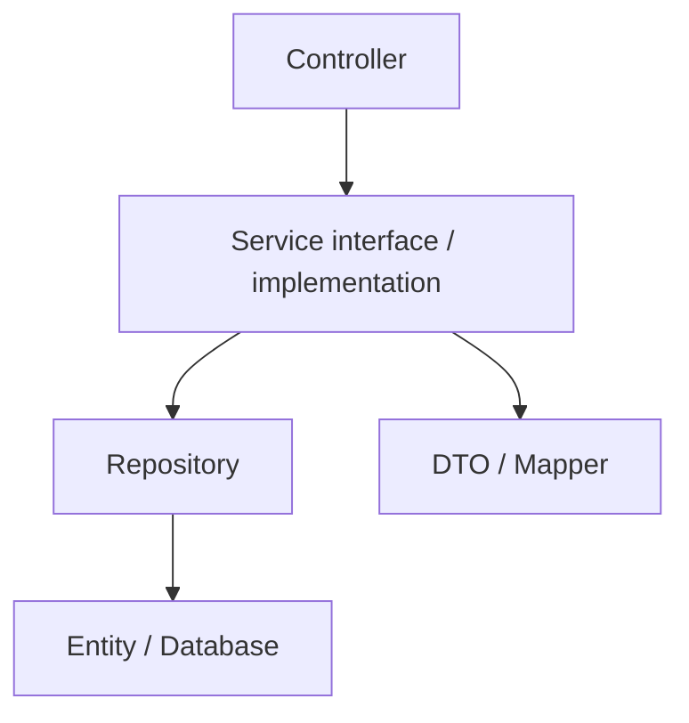
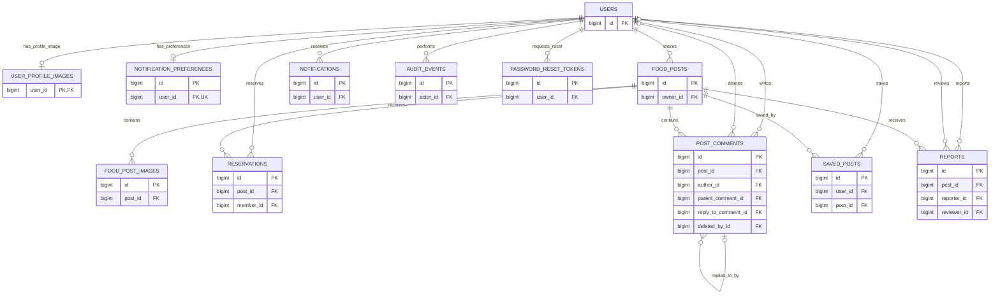

# KKU FoodShare


**ระบบแบ่งปันอาหารภายในมหาวิทยาลัยขอนแก่น** ช่วยส่งต่ออาหารส่วนเกินและลดอาหารเหลือทิ้ง  
ผู้แบ่งปันสร้างโพสต์ ระบุจำนวน เวลา จุดรับ และแนบรูปภาพ ส่วนผู้รับค้นหาและจองอาหารได้  
เจ้าของยืนยันการรับด้วย QR หรือรหัสรับอาหาร พร้อมจัดการสต็อกและรายการแจกนอกเว็บ  
ระบบรองรับความคิดเห็น บันทึกโพสต์ โปรไฟล์ และการแจ้งเตือน โดยออกแบบตามหลัก Software Design


## สมาชิกกลุ่ม

| ลำดับ | ชื่อ-นามสกุล | รหัสนักศึกษา | Section | Branch | หน้าที่รับผิดชอบ |
|:---:|---|---|:---:|---|---|
| 1 | นางสาวกัญญาวี ศรีเหรา | 673380026-6 | 1 | `kanyawi_6733800266_01` |การสร้าง แก้ไข และปิดโพสต์อาหาร การแสดงรายการโพสต์และหน้ารายละเอียดโพสต์ |
| 2 | นางสาวรสริน เมืองหงษ์ | 673380289-4 | 1 | `rossarin_6733802894_01` | การจองและยกเลิกการจองอาหาร การจัดการสต็อก การยืนยันรับอาหารด้วย QR Code/รหัสรับอาหาร และระบบแจ้งเตือน | 
| 3 | นางสาวสโรชา เสาทอง | 673380296-7 | 1 | `sarocha_6733802967_01` |  ความคิดเห็น บันทึกโพสต์ โปรไฟล์ และหน้าจอทั่วไป backend deploy swagger ui | 
| 4 | นายปวริศร์ แพงมา | 673380047-8 | 1 | `pawarit_6733800478_01` | สมัคร เข้าสู่ระบบ, Google Login, จัดการรหัสผ่าน, ตรวจสอบสิทธิ์ ADMIN, จัดการรายงานโพสต์และระงับสมาชิก พร้อมระบบส่งอีเมล|
> **ชื่อ Branch เป็นชื่อที่เสนอให้ตรงรูปแบบใบงาน** ต้องตรวจให้ตรงกับ branch ที่ใช้จริงก่อนส่ง หน้าที่ข้างต้นเป็นการแบ่งขอบเขตดูแล/ศึกษาต่อ ต้องยืนยันกับงานที่สมาชิกทำจริงและ Git history

ทีมใช้ `develop` รวมงาน และ `main` สำหรับรุ่นส่ง แต่ละคน Commit/Push ด้วยบัญชีของตนเอง และรวมงานผ่าน Pull Request ที่มี reviewer อย่างน้อยหนึ่งคน ตามเกณฑ์ใบงานทุกคนต้องมี meaningful commits อย่างน้อย 15 ครั้งกระจายตลอดช่วงทำงาน

## Tech Stack

| ส่วนของระบบ | เทคโนโลยี |
|---|---|
| Backend | Java target 17, Spring Boot 4.1.1, Spring MVC, Maven Wrapper |
| Frontend | Thymeleaf, JavaScript, CSS, Leaflet |
| Security | Spring Security, Session, CSRF, BCrypt, Google OAuth2 |
| Persistence | Spring Data JPA / Hibernate, PostgreSQL, Flyway |
| Image Storage | Local storage หรือ Cloudinary ตาม configuration |
| Email | SMTP หรือ Brevo ตาม configuration |
| Testing | JUnit, Mockito, Spring Boot Test, H2, Node test runner, Playwright |
| Container / CI | Docker, Docker Compose, GitHub Actions |

### ฟีเจอร์ในโค้ดปัจจุบัน

| กลุ่มฟีเจอร์ | ความสามารถ |
|---|---|
| สมาชิก | สมัครสมาชิก ล็อกอินอีเมล/Google รีเซ็ตรหัสผ่าน โปรไฟล์ รูปโปรไฟล์ และ onboarding |
| โพสต์อาหาร | สร้าง แก้ไข ปิดโพสต์ แนบหลายรูป กำหนดจำนวน เวลา จุดรับ และขีดจำกัดการจอง |
| ค้นหาและแผนที่ | ค้นหา/กรอง/เรียงรายการ ค้นหาจุดรับ เลือกพิกัด และเปิดลิงก์นำทาง |
| การจองและรับอาหาร | จอง ยกเลิก QR/รหัสรับ ยืนยันส่งมอบ และปรับสต็อก walk-in |
| ชุมชน | ความคิดเห็น/คำตอบ บันทึกโพสต์ รายงานโพสต์หรือความคิดเห็น |
| การแจ้งเตือน | กระดิ่ง การตั้งค่าความสนใจ และงานเตือนรับอาหาร/โพสต์ที่บันทึก |
| ผู้ดูแล | จัดการรายงาน ปิดโพสต์ ระงับสมาชิก และเก็บ audit events |

Google login, email และ cloud image storage ต้องตั้งค่าบริการที่เลือกก่อนใช้งาน ผลทดสอบของ providers ไม่แทนการตรวจ credentials จริงในระบบ deploy

## System Architecture

ระบบใช้ **Layered Architecture** แยกการรับ HTTP กฎธุรกิจ และการเข้าถึงฐานข้อมูล ส่วนหน้าเว็บใช้ **MVC** ผ่าน Thymeleaf



| ชั้น | หน้าที่ |
|---|---|
| Controller | รับคำขอ ตรวจรูปแบบข้อมูล และเรียก Service |
| Service | ตรวจสิทธิ์ กฎธุรกิจ และ transaction |
| Repository | อ่าน/บันทึกข้อมูลผ่าน Spring Data JPA |
| Domain / Entity | โครงสร้างข้อมูลและกฎของสถานะ/จำนวน |
| DTO / Mapper | กำหนดข้อมูลที่ส่งออกและแปลงจาก Entity |

Controller ใช้ Service interface และ constructor injection API ส่ง DTO แทน Entity การโหลดข้อมูลประกอบโพสต์อยู่ใน `PostViewService` ส่วน Mapper แปลงข้อมูลโดยไม่เรียก Repository

- [SOLID Analysis](doc/solid-analysis.md) — ตัวอย่างทั้ง 5 หลักการพร้อมไฟล์และบรรทัด
- [Design Patterns](doc/design-patterns.md) — Enterprise patterns 6 แบบ และ Behavioral patterns
- [Diagrams](doc/diagrams/README.md) — ภาพรวมระบบและลำดับการทำงาน
- [Use Case Descriptions](doc/diagrams/use-case-descriptions.md)

Behavioral patterns ได้แก่ **Strategy** สำหรับการค้นหา, **Observer** ผ่าน Spring events และ **State** แบบ enum behavior/guard ของสถานะการจอง การ transition และปรับ stock ยังอยู่ใน Service

## Database Design (ER Diagram)

ระบบใช้ PostgreSQL และมี **12 ตารางแอป** แบ่งตามข้อมูลดังนี้:

| กลุ่มข้อมูล | ตาราง |
|---|---|
| สมาชิก | `users`, `user_profile_images`, `password_reset_tokens` |
| โพสต์ | `food_posts`, `food_post_images` |
| การจอง | `reservations` |
| แจ้งเตือน | `notifications`, `notification_preferences` |
| ชุมชนและประวัติ | `post_comments`, `saved_posts`, `reports`, `audit_events` |

### ER Diagram — ภาพรวมฐานข้อมูลทั้งระบบ

แสดง Entity ทั้ง 12 ตาราง พร้อม Primary Key และ Foreign Key หลัก



### ประเภทความสัมพันธ์

- **One-to-One:** สมาชิกกับรูปโปรไฟล์ และสมาชิกกับการตั้งค่าแจ้งเตือน สมาชิกมีข้อมูลแต่ละประเภทได้สูงสุดหนึ่งรายการ

- **One-to-Many:** สมาชิกกับโพสต์ การจอง ความคิดเห็น รายการบันทึกโพสต์ การแจ้งเตือน รายงานปัญหา ประวัติการทำงาน และโทเคนรีเซ็ตรหัสผ่าน รวมถึงโพสต์กับรูปภาพ การจอง ความคิดเห็น รายการบันทึกโพสต์ และรายงานปัญหา

- **Self-referencing:** ความคิดเห็นอ้างอิงความคิดเห็นในตารางเดียวกันผ่าน `parent_comment_id` และ `reply_to_comment_id` เพื่อรองรับการตอบกลับ

- **Many-to-Many:** สมาชิกกับโพสต์ที่บันทึกไว้ ผ่านตารางเชื่อม `saved_posts` ซึ่งมี `user_id` และ `post_id` พร้อม Unique Constraint ของคู่นี้เพื่อป้องกันการบันทึกซ้ำ ใน Java ใช้ Entity `SavedPost` เชื่อมด้วย `@ManyToOne` สองด้าน

PK = Primary Key, FK = Foreign Key, UK = Unique Key

ภาพนี้แสดงคีย์และความสัมพันธ์หลัก ไม่ได้แสดงทุกคอลัมน์ รายละเอียดชนิดข้อมูล ข้อบังคับ และ Index ให้ดูใน ER Diagram ฉบับเต็มและ Data Dictionary ใน `doc/`
- [ER Diagram ครบทุกตาราง](doc/diagrams/README.md#er)
- [Data Dictionary, FK, Index, Fetch และ Cascade](doc/data-dictionary.md)

Migration อยู่ใน `code/src/main/resources/db/migration/` รุ่นปัจจุบันมี V1–V10 ระบบใช้ **Flyway migration และ Hibernate validate** ไม่ใช้ Hibernate เปลี่ยน schema อัตโนมัติ และไม่แก้ migration ที่ใช้กับฐานข้อมูลจริงไปแล้ว

## Installation & Setup

### เครื่องมือที่ใช้

| วิธีใช้งาน | เครื่องมือ |
|---|---|
| รันด้วย container | Docker Desktop/Engine และ Docker Compose |
| รันด้วย Maven | JDK 17 และ PostgreSQL |
| JavaScript / Browser tests | Node.js และ Playwright สำหรับ browser tests |

### ตั้งค่า environment สำหรับ Docker

เปิด PowerShell ที่โฟลเดอร์ `kku-foodshare`:

```powershell
powershell -ExecutionPolicy Bypass -File .\scripts\setup-env.ps1
```

macOS/Linux:

```bash
bash scripts/setup-env.sh
```

สคริปต์สร้าง `.env` พร้อมรหัสผ่านฐานข้อมูลและ `APP_SECRET` แบบสุ่ม หากมี `.env` อยู่แล้วจะคงไฟล์เดิมไว้

| Variable | การใช้งาน |
|---|---|
| `DATABASE_PASSWORD` | รหัสผ่าน PostgreSQL |
| `APP_SECRET` | secret ของแอป อย่างน้อย 32 ตัวอักษร |
| `APP_PORT` | พอร์ตเว็บบนเครื่อง เช่น `8080` หรือ `8081` |
| `APP_BASE_URL` | URL ของแอป ใช้กับลิงก์รีเซ็ตรหัสผ่าน |
| `IMAGE_STORAGE_PROVIDER` | `local` หรือ `cloudinary` |
| `MAIL_PROVIDER` | `smtp` หรือ `brevo` |

### PostgreSQL สำหรับการรันด้วย Maven

ถ้าใช้ PostgreSQL ในเครื่อง สามารถสร้างฐานข้อมูลใหม่ด้วย `psql` หรือ pgAdmin:

```sql
CREATE DATABASE foodshare;
```

ค่าเริ่มต้นใน configuration คือ `jdbc:postgresql://localhost:5432/foodshare` และ username `foodshare` หากใช้ชื่อฐานข้อมูลหรือบัญชีต่างกัน ให้ตั้ง `DATABASE_URL` และ `DATABASE_USER` ให้ตรงเครื่องของคุณ

ตัวอย่าง PowerShell สำหรับบัญชี PostgreSQL ชื่อ `postgres`:

```powershell
$env:DATABASE_URL="jdbc:postgresql://localhost:5432/foodshare"
$env:DATABASE_USER="postgres"
$env:DATABASE_PASSWORD="YOUR_DB_PASSWORD"
$env:APP_SECRET=([guid]::NewGuid().ToString("N") + [guid]::NewGuid().ToString("N"))
$env:APP_BASE_URL="http://localhost:8080"
```

กำหนดค่าใน Terminal เดียวกับที่รัน Maven การมี `.env` ไม่ได้ทำให้ Maven โหลด environment ให้อัตโนมัติ

### Google OAuth2 และอีเมล

ตั้งค่าตามบริการที่ต้องการใช้ โดยอ่านค่าจาก `.env` สำหรับ Docker หรือ environment variables สำหรับ Maven:

| บริการ | ค่าที่ต้องตั้ง |
|---|---|
| Google login | เปิด profile `google` ผ่าน `SPRING_PROFILES_ACTIVE` และตั้ง `GOOGLE_CLIENT_ID`, `GOOGLE_CLIENT_SECRET` |
| SMTP | เปิด profile `mail`, ตั้ง `MAIL_PROVIDER=smtp`, `MAIL_HOST`, `MAIL_PORT`, `MAIL_USERNAME`, `MAIL_PASSWORD`, `MAIL_FROM` |
| Brevo | ตั้ง `MAIL_ENABLED=true`, `MAIL_PROVIDER=brevo`, `BREVO_API_KEY`, `MAIL_FROM` |
| Cloudinary | ตั้ง `IMAGE_STORAGE_PROVIDER=cloudinary`, `CLOUDINARY_CLOUD_NAME`, `CLOUDINARY_API_KEY`, `CLOUDINARY_API_SECRET` |

หากเปิด Google และ SMTP พร้อมกัน ใช้ `SPRING_PROFILES_ACTIVE=google,mail` Google OAuth Client ต้องกำหนด redirect URI ให้ตรง URL ที่ใช้งาน เช่น `http://localhost:8080/login/oauth2/code/google` หรือเปลี่ยนพอร์ตเป็น `8081` ตาม environment

ดู [รายละเอียด configuration และ deployment](doc/deployment.md)

> เก็บ `.env`, Client Secret, API keys และรหัสผ่านไว้นอก Git เมื่ออัปเกรดระบบเดิม ให้รักษา `.env`, `APP_SECRET` และ Compose project เดิมเพื่อใช้งานต่อ

## How to Run

### Docker Compose

จากโฟลเดอร์ `kku-foodshare`:

```powershell
docker compose -p kku-foodshare-phase1 -f docker-compose.yml up --build -d
docker compose -p kku-foodshare-phase1 -f docker-compose.yml ps
docker compose -p kku-foodshare-phase1 -f docker-compose.yml logs -f app
```

เปิดเว็บตาม `APP_PORT` ใน `.env`:

| พอร์ต | URL |
|---|---|
| `8080` | [http://localhost:8080](http://localhost:8080) |
| `8081` | [http://localhost:8081](http://localhost:8081) |

หยุดระบบโดยเก็บข้อมูลฐานข้อมูลไว้:

```powershell
docker compose -p kku-foodshare-phase1 -f docker-compose.yml down
```

ไม่เติม `-v` เมื่อต้องการเก็บ database volume

### Maven Wrapper

ตั้ง PostgreSQL และ environment variables ก่อน แล้วรัน:

**Windows PowerShell**

```powershell
cd code
.\mvnw.cmd spring-boot:run
```

**macOS/Linux**

```bash
cd code
bash ./mvnw spring-boot:run
```

Maven ใช้พอร์ต `8080` ตามค่าเริ่มต้น หากต้องการ `8081` ให้ตั้ง `PORT=8081` และ `APP_BASE_URL` ให้ตรง URL ก่อนรัน กล้องและ GPS ต้องได้รับสิทธิ์ผู้ใช้ และใช้ HTTPS หรือ localhost

## API Documentation

| รายการ | Path |
|---|---|
| Swagger UI | `/swagger-ui/index.html` หรือ `/swagger-ui.html` |
| OpenAPI specification | `/v3/api-docs` |
| Health check | `/actuator/health` |

ตัวอย่างเมื่อรันพอร์ต 8081: [Swagger UI](http://localhost:8081/swagger-ui/index.html)

ดู [REST API และ Endpoint Inventory](doc/api.md) สำหรับ HTTP methods, status codes, validation, error responses และ pagination

CRUD หลักคือโพสต์อาหารและการจอง การปิดโพสต์/ยกเลิกการจองรักษาประวัติของรายการ คำขอที่เปลี่ยนข้อมูลต้องมี session และ CSRF token ตาม configuration ของระบบ

## How to Run Tests

### Java — JUnit, Mockito และ Spring Boot Test

จากโฟลเดอร์โปรเจกต์:

```powershell
New-Item -ItemType Directory -Force test/reports/java, test/reports/javascript
cd code
.\mvnw.cmd clean verify 2>&1 | Tee-Object ../test/reports/java/java-run.txt
```

หลัง `BUILD SUCCESS` ให้เก็บ Surefire reports:

```powershell
Copy-Item -Recurse -Force target/surefire-reports ../test/reports/java/
cd ..
```

macOS/Linux ใช้ `bash ./mvnw clean verify` จากโฟลเดอร์ `code` Java tests ใช้ H2 ในหน่วยความจำตาม test configuration

### JavaScript — Node test runner

จากโฟลเดอร์โปรเจกต์:

```powershell
$jsTests = @(Get-ChildItem code/src/test/js/*.test.mjs | ForEach-Object { $_.FullName })
node --test $jsTests 2>&1 | Tee-Object test/reports/javascript/javascript-run.txt
```

macOS/Linux:

```bash
node --test code/src/test/js/*.test.mjs
```

### ผลทดสอบที่มีหลักฐาน

ผลรันบนเครื่องผู้จัดทำวันที่ **8 ตุลาคม 2026**:

| ชุดทดสอบ | ทั้งหมด | ผ่าน | ไม่ผ่าน / Errors | ข้าม |
|---|---:|---:|---:|---:|
| Java | 116 | 116 | 0 | 0 |
| JavaScript | 123 | 123 | 0 | 0 |
| **รวมของรอบนี้** | **239** | **239** | **0** | **0** |

Java แสดง `BUILD SUCCESS` และสร้าง executable JAR สำเร็จบน Java 26.0.2 ของผู้จัดทำ ส่วน `pom.xml` กำหนด Java target 17

ผลทดสอบเพิ่มเติม:

| ชุดทดสอบ | วันที่รัน | หน่วยนับ | ผ่าน | ไม่ผ่าน / Errors | ข้าม / ไม่ได้รัน |
|---|---|---|---:|---:|---:|
| Java/JUnit ร่วมกับ PostgreSQL ใน Docker | 9 ตุลาคม 2026 | กรณีทดสอบ | 48 | 0 | 0 |
| Browser automation | 9 ตุลาคม 2026 | สคริปต์ทดสอบ | 9 | 0 | 0 |

ชุด PostgreSQL รันบน Java 17 เชื่อมต่อฐานข้อมูลจริงใน Docker และใช้ Flyway migrations ครบ 10 รายการ โดยจบด้วย `BUILD SUCCESS`

Browser automation ผ่านครบทั้ง 9 scripts แต่ละ script อาจมีหลายกรณีทดสอบ โดยมีทั้งการตรวจ source การใช้ข้อมูลจำลอง และการทดสอบเว็บที่ `http://localhost:8081`

ไม่รวมจำนวนข้ามรอบเข้าด้วยกัน เนื่องจากอาจมีกรณีทดสอบซ้ำ และใช้หน่วยนับต่างกัน ผลทดสอบในเครื่องไม่ได้ยืนยันการทำงานของ deployment สาธารณะโดยอัตโนมัติ

- [Test Reports](https://github.com/sarochaza/kku-foodshare/tree/main/test/reports)
- [คู่มือ Browser และ PostgreSQL checks](test/README.md)
- [สถานะผลตรวจและหลักฐาน](test/reports/verification.md)


## Deployment URL

| รายการ | URL |
|---|---|
| เว็บไซต์ | [https://kku-foodshare.onrender.com](https://kku-foodshare.onrender.com) |
| Swagger UI | [https://kku-foodshare.onrender.com/swagger-ui/index.html](https://kku-foodshare.onrender.com/swagger-ui/index.html) |

ดู [Deployment Guide](doc/deployment.md) สำหรับการตั้งค่าฐานข้อมูล รูปภาพ และอีเมล ระบบมี `Dockerfile` และ `docker-compose.yml` ส่วน workflow ปัจจุบันยังไม่มีขั้น deploy อัตโนมัติ

## Project Structure

| ตำแหน่ง | เนื้อหา |
|---|---|
| `README.md` | ภาพรวม สมาชิก วิธีติดตั้ง รัน ทดสอบ และ deployment |
| `code/pom.xml` | Dependencies และ Maven build configuration |
| `code/src/main/java/com/kku/foodshare/` | Production Java: config, controller, domain, dto, exception, mapper, repository, security, service |
| `code/src/main/resources/templates/` | หน้าเว็บ Thymeleaf |
| `code/src/main/resources/static/` | JavaScript, CSS, รูปภาพ, fonts และ vendor assets |
| `code/src/main/resources/db/migration/` | Flyway migrations V1–V10 |
| `code/src/test/java/` | Java test sources |
| `code/src/test/js/` | JavaScript test sources |
| `code/src/test/resources/` | Java test configuration |
| `test/browser/` | Browser journeys และ UI/fixture checks |
| `test/reports/java/` | Maven console log และ Surefire XML/TXT |
| `test/reports/javascript/` | Node test runner log |
| `test/reports/source-review/` | หลักฐานตรวจโครงสร้างระหว่างพัฒนา |
| `test/reports/test-report.md` | รายงานสรุปผลทดสอบ |
| `doc/` | SOLID, Patterns, API, Data Dictionary และ Deployment |
| `doc/diagrams/` | Use Case, Domain, Class, Sequence, Activity, ER, Component, Deployment และ State |
| `doc/slide/` | โฟลเดอร์สไลด์นำเสนอของทีม ยังต้องเพิ่มไฟล์สไลด์จริง |
| `img/` | ภาพประกอบและหลักฐานภาพของระบบ |
| `scripts/` | ตั้งค่า environment และ backup/restore |
| `.github/workflows/` | GitHub Actions verification |
| `Dockerfile`, `docker-compose.yml` | Build และรันระบบด้วย container |

[Third-party notices](doc/third-party.md) · [รายการ source changes จากต้นฉบับ](test/reports/source-review/source-changes.csv)
