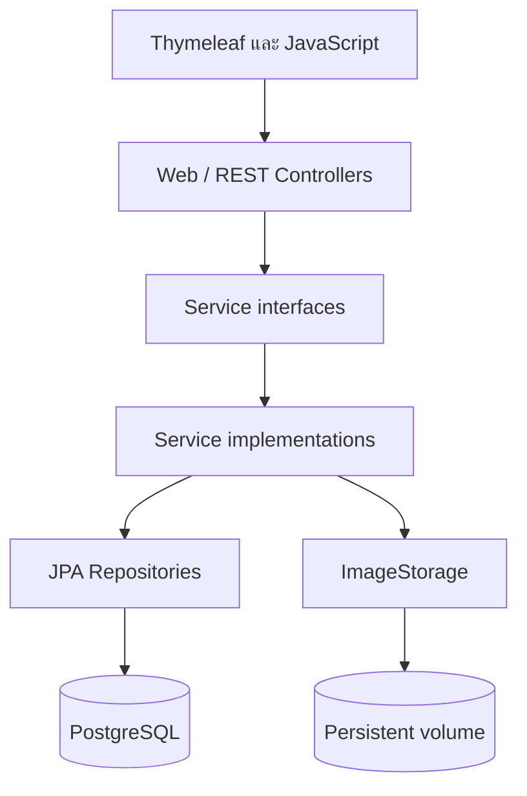
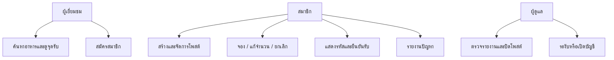
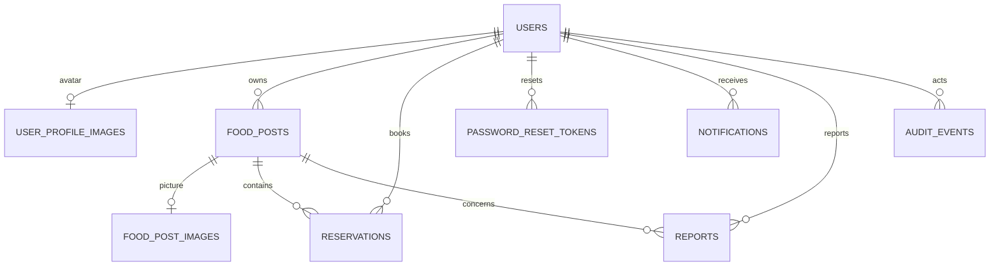
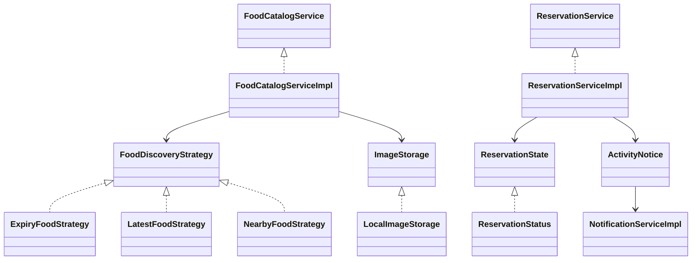
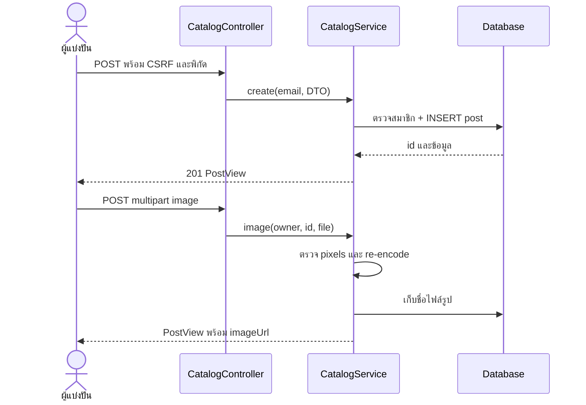
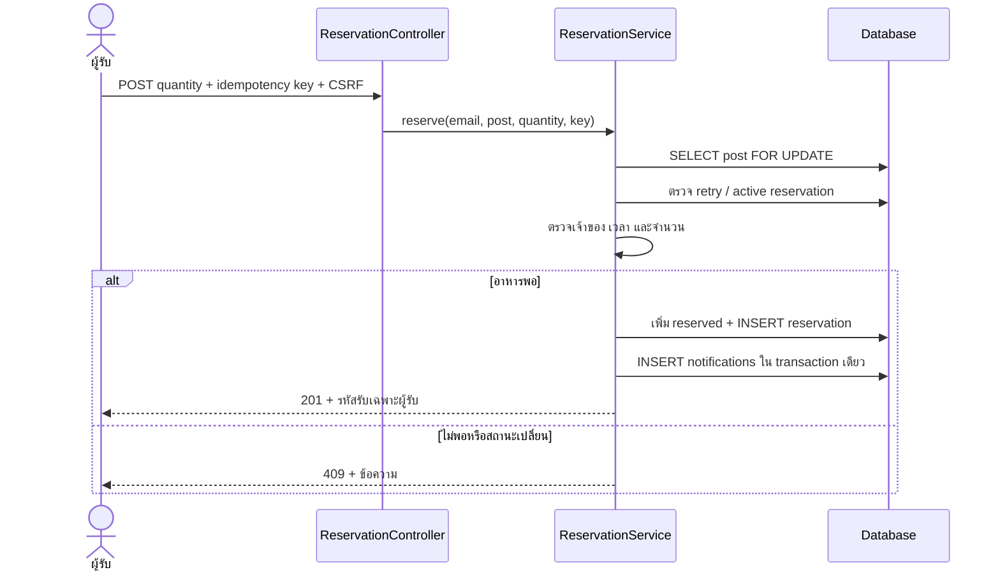
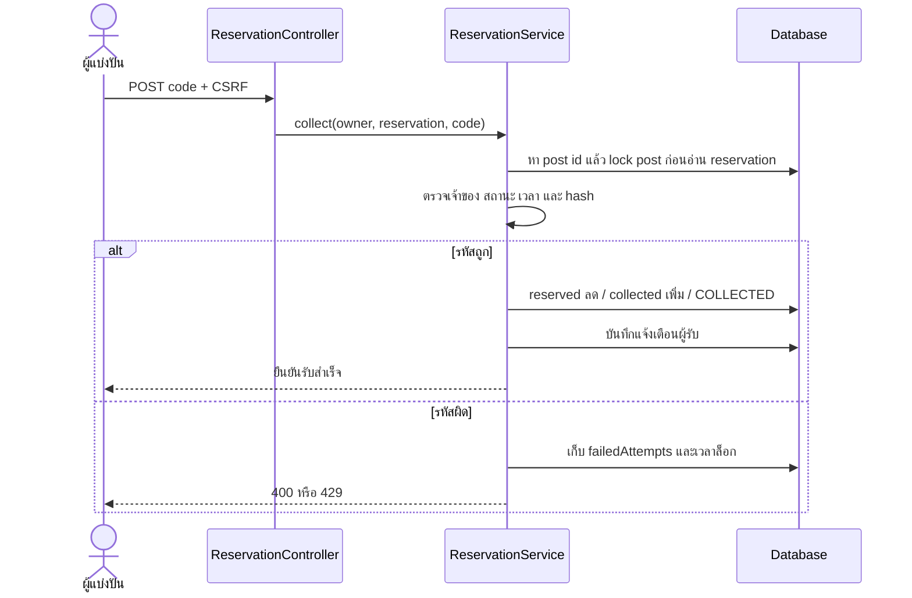
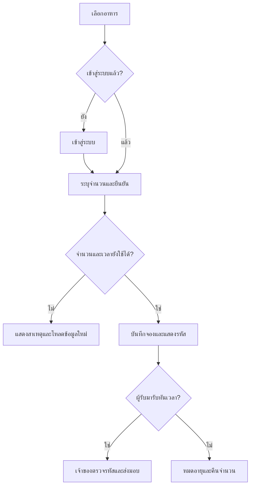
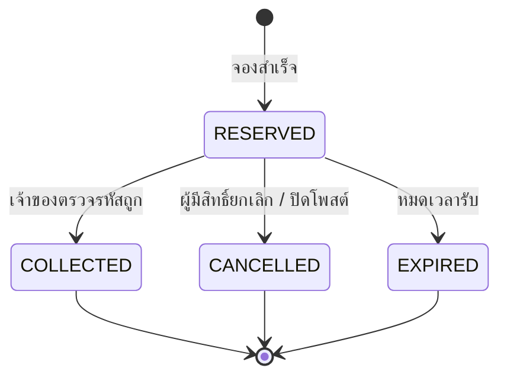
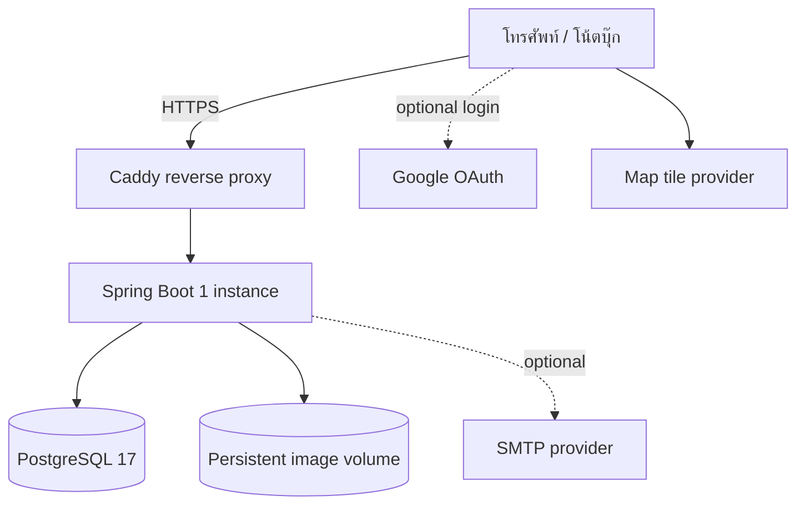

# Architecture and design

## Layered architecture

Controller รับ HTTP/validation และเรียก service interface เท่านั้น ไม่เรียก Repository โดยตรง Service จัดการ authorization, transaction, stock และ state ส่วน Repository ติดต่อ SQL ผ่าน JPA DTO แยกจาก Entity; ใช้ constructor injection

## Use cases

## Domain / ER model

| Table | หน้าที่ / หลักการ |
|---|---|
| users | สมาชิก, email แบบ unique ไม่แยกตัวพิมพ์, BCrypt, active/role, optimistic version |
| user_profile_images | PK/FK user_id ความสัมพันธ์ one-to-one, bytea และ content type |
| password_reset_tokens | SHA-256 token hash, อายุ/เวลาที่ใช้แล้ว, version, FK user |
| food_posts | เจ้าของ รายละเอียด พิกัด ช่วงเวลา total/reserved/collected และ version |
| food_post_images | หนึ่งรูปต่อโพสต์, ชื่อ UUID ที่ระบบสร้าง |
| reservations | จำนวน/สถานะ/idempotency key/รหัสรับเข้ารหัสและ hash/lock/version |
| notifications | ข้อความภายในระบบและเวลาอ่าน |
| reports | ผู้รายงาน โพสต์ เหตุผล ผลตรวจ ผู้ดูแลและ version |
| audit_events | ผู้กระทำ action เป้าหมาย เหตุผล และเวลา |

Migration V1 มี FK, check constraints, index และ partial unique index บังคับหนึ่ง active reservation ต่อคนต่อโพสต์ V2 เพิ่ม version ของ users. `available = quantity - reserved - collected` ต้องไม่ติดลบ ช่วงรับต้องสิ้นสุดหลังเริ่ม และพิกัดต้องอยู่ในช่วงละติจูด/ลองจิจูดจริง

## Class / pattern relationships

| หลักการ | จุดใช้จริง |
|---|---|
| SRP | LocalImageStorage ตรวจ/แปลง/เก็บรูป; PickupCodeService สร้างและป้องกันรหัส; NotificationServiceImpl เก็บข้อความ |
| OCP | FoodDiscoveryStrategy เพิ่มลำดับค้นหาใหม่โดยเพิ่ม implementation และเลือกผ่าน strategy registry |
| LSP | Expiry/Latest/Nearby มี contract สร้าง Order ให้ Criteria query เดียวกัน |
| ISP | FoodCatalogService, ReservationService, ModerationService และ ImageStorage แยกตามหน้าที่ของผู้เรียก |
| DIP | Controller พึ่ง service interface; catalog พึ่ง ImageStorage; implementation รับ dependency ผ่าน constructor |
| Strategy (behavioral) | FoodDiscoveryStrategy เลือกลำดับ expiry/latest/nearby |
| State (behavioral) | ReservationStatus implements ReservationState; requireMutable อนุญาตเฉพาะ RESERVED |
| Observer (behavioral) | ActivityNotice และ PostClosed ใช้ Spring application events; listeners สร้าง notification และยกเลิกการจอง |

ไม่มีการนับ annotation/framework repository เป็น GoF pattern เพิ่มเติม ทั้ง 3 patterns เป็น behavioral ตามข้อกำหนด “อย่างน้อยหนึ่งกลุ่ม” ของใบงาน

## Sequence 1: สร้างโพสต์

## Sequence 2: จองพร้อมกัน

## Sequence 3: ส่งมอบอาหาร

## Activity และ state

## Component / deployment

Security ใช้ session + CSRF, active-account filter, ownership ใน service, BCrypt, AES-GCM สำหรับรหัสรับที่จำเป็นต้องแสดงซ้ำ, pessimistic post locks และ optimistic versions การเรียก mutating service อยู่ใน transaction; notifications ภายในฐานข้อมูล rollback พร้อมธุรกรรมหลัก

## Source references

เลขบรรทัดอ้างอิง source ในแพ็กเกจนี้

| เรื่อง | ไฟล์ | บรรทัด |
|---|---|---:|
| SRP / รูป | `code/src/main/java/com/kku/foodshare/service/storage/LocalImageStorage.java` | 17 |
| DIP / constructor | `code/src/main/java/com/kku/foodshare/service/impl/FoodCatalogServiceImpl.java` | 35 |
| OCP / Strategy interface | `code/src/main/java/com/kku/foodshare/service/discovery/FoodDiscoveryStrategy.java` | 6 |
| LSP / Nearby strategy | `code/src/main/java/com/kku/foodshare/service/discovery/NearbyFoodStrategy.java` | 9 |
| ISP / Reservation contract | `code/src/main/java/com/kku/foodshare/service/ReservationService.java` | 6 |
| State | `code/src/main/java/com/kku/foodshare/domain/entity/ReservationStatus.java` | 6 |
| Observer listener | `code/src/main/java/com/kku/foodshare/service/impl/NotificationServiceImpl.java` | 28 |
| Atomic stock lock | `code/src/main/java/com/kku/foodshare/service/impl/ReservationServiceImpl.java` | 93 |
| User concurrency | `code/src/main/java/com/kku/foodshare/domain/entity/User.java` | 41 |
