# Diagrams

Diagram sources describe the submitted code. Use Case uses PlantUML; the diagrams below render as Mermaid. Deployment shows the cloud configuration described in the existing phase notes, not proof of a live deployment. Local Docker uses PostgreSQL and local volumes unless cloud providers are configured.

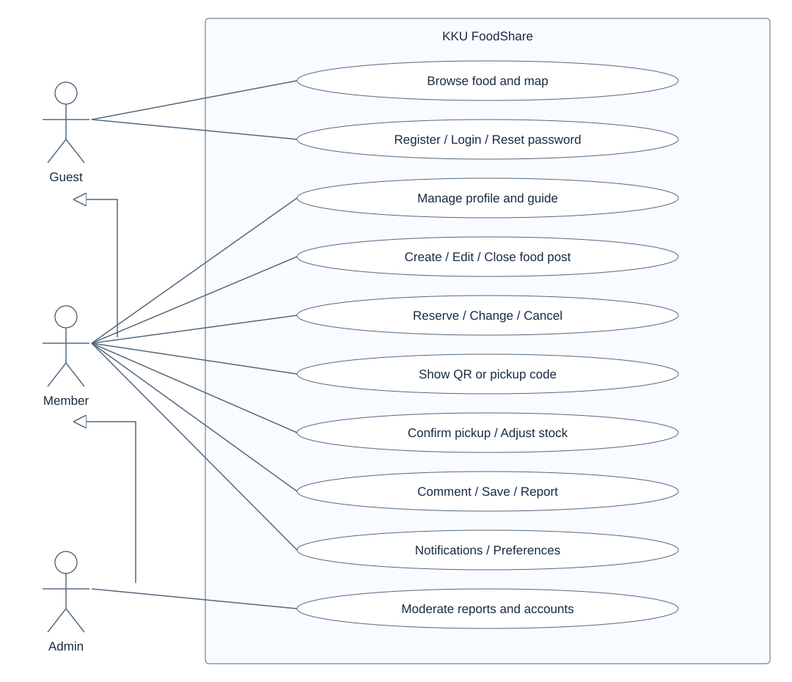

[Use Case source](use-case.puml) · [Use Case descriptions](use-case-descriptions.md)

## Domain

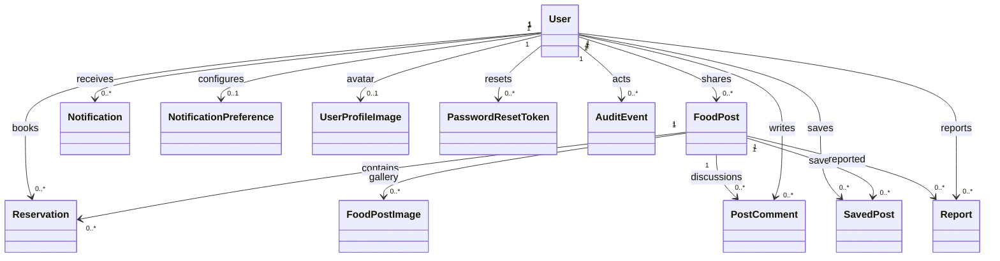

## Class

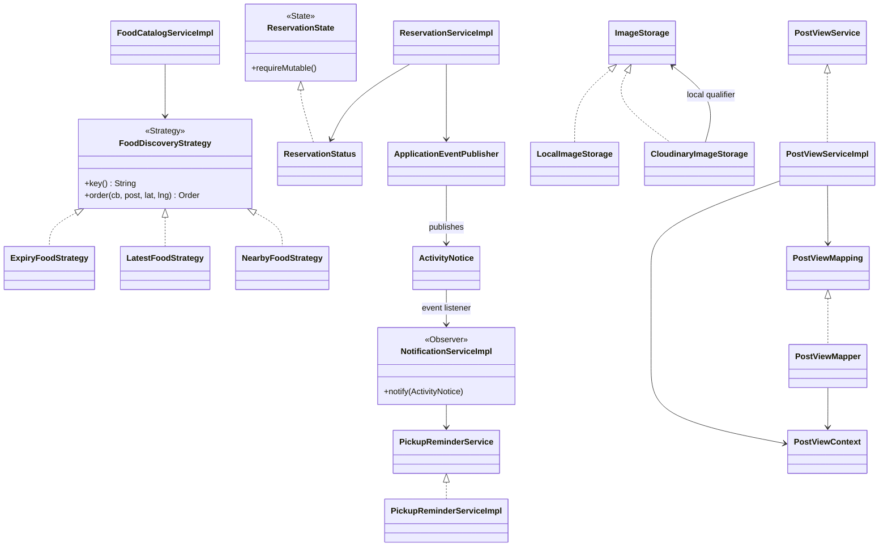

## Sequence Create

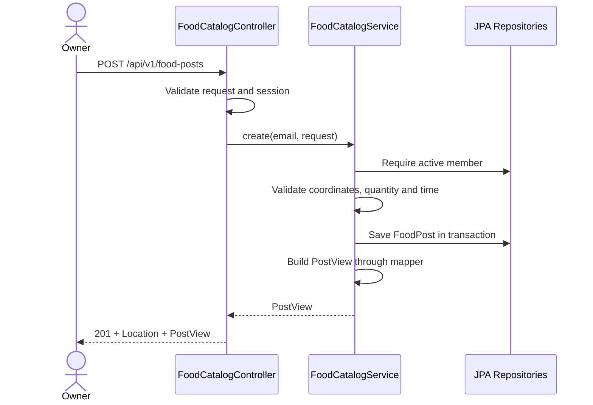

## Sequence Reserve

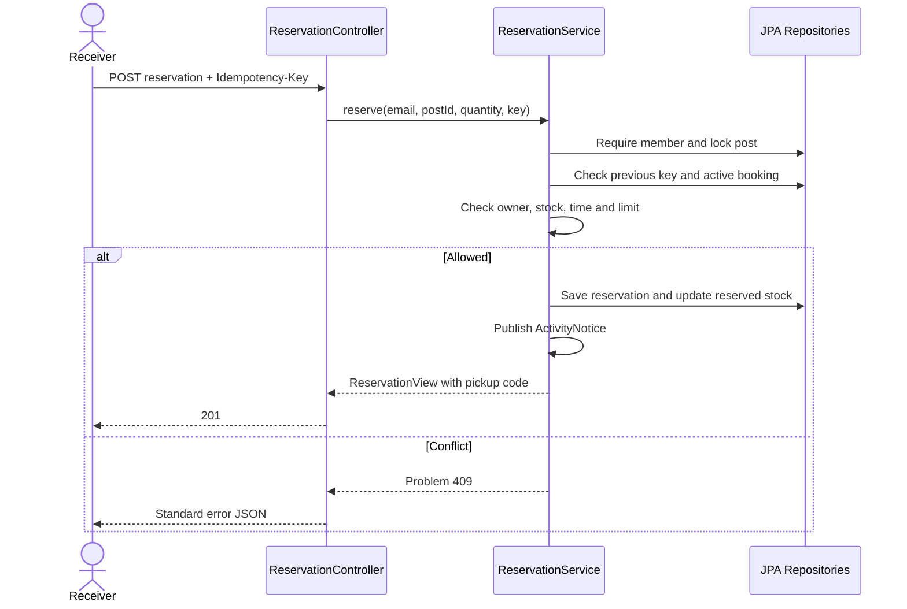

## Sequence Collect

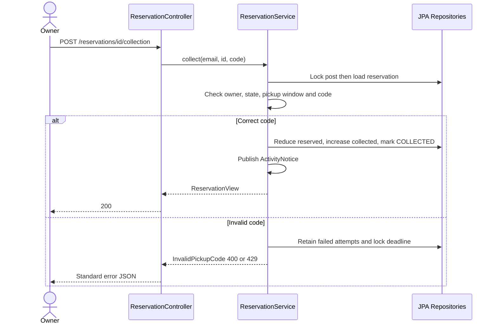

## Activity

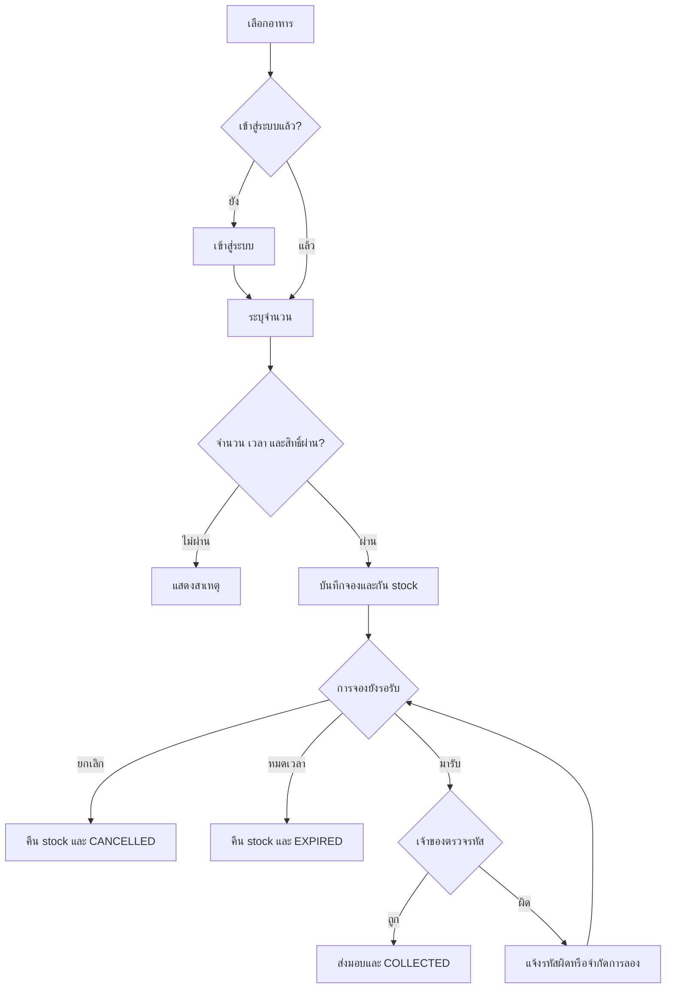

## State

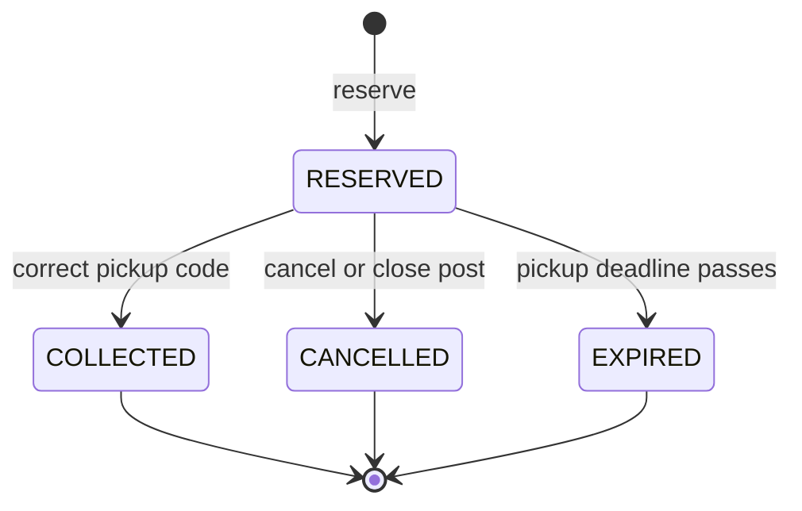

## Component

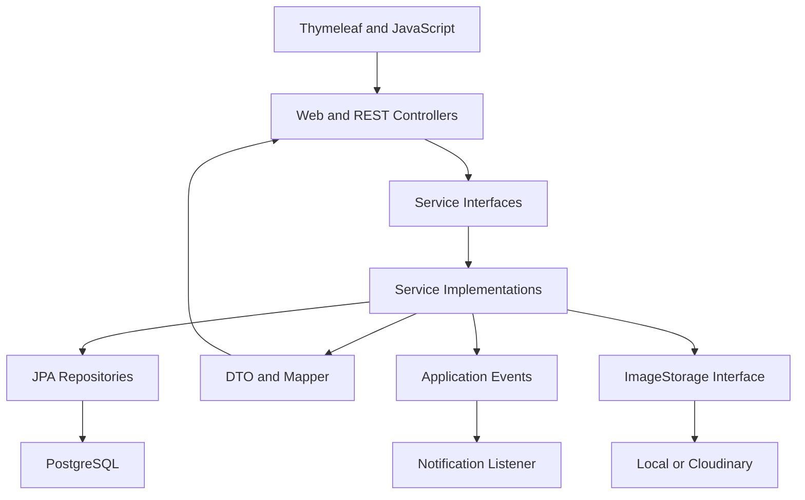

## Deployment

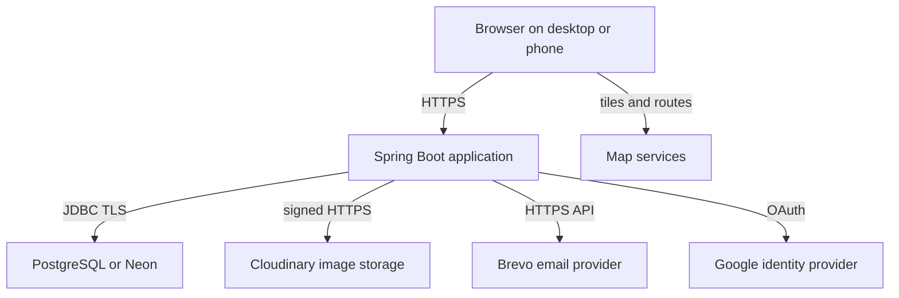

## Er

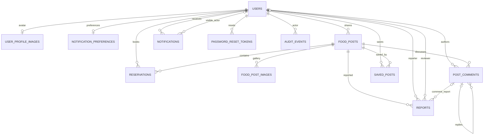
