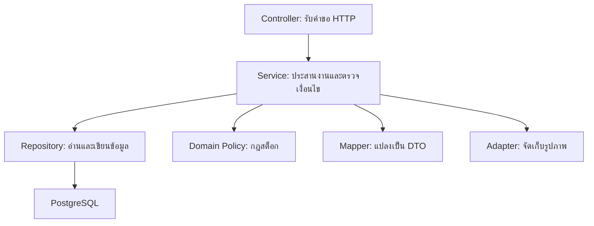

# การวิเคราะห์ SOLID และการแยก Layer ของ KKU FoodShare

เอกสารสำหรับข้อกำหนด: **“แยก Layer ชัดเจน ไม่ข้าม Layer ใช้ Constructor Injection และมี doc/solid-analysis.md ระบุไฟล์และบรรทัด”**

วันที่ตรวจหลักฐาน: **9 ตุลาคม 2026**  
แหล่งอ้างอิง: โค้ด Phase 12 ในชุดงานที่ใช้จัดทำเอกสารรอบนี้

เลขบรรทัดทั้งหมดในเอกสารอ้างอิงไฟล์ที่ตรวจจริง ไม่ใช่เลขบรรทัดจากตัวอย่างทั่วไป หากแก้ไขหรือรวมโค้ดก่อนส่งงาน ต้องตรวจเลขบรรทัดอีกครั้ง โค้ดที่ใช้จัดทำเอกสารไม่มีข้อมูล Git Commit ให้ยืนยัน จึงไม่ควรนำเลขบรรทัดนี้ไปอ้างว่าเป็นของ Commit บน main โดยไม่ตรวจเทียบ

## 1. วัตถุประสงค์และขอบเขต

เอกสารนี้อธิบายว่าแต่ละชั้นของระบบมีหน้าที่อะไร พึ่งพากันอย่างไร และนำ SOLID มาใช้กับปัญหาใด โดยระบุหลักฐานในรูปแบบ **ไฟล์:บรรทัดเริ่ม–บรรทัดสิ้นสุด** เพื่อให้ผู้ตรวจเปิดดูได้ตรงตำแหน่ง

ตรวจเฉพาะส่วนที่เกี่ยวข้องกับ Layer, Dependency Injection และตัวอย่าง SOLID ได้แก่ Controller, Service, Repository, Domain Policy, Mapper, Discovery Strategy, Image Storage และเทสที่เกี่ยวข้อง การตรวจอ้างอิงในเอกสารเป็นการตรวจจากโค้ด ไม่ใช่การยืนยันว่าทุกพฤติกรรมบนเว็บที่ Deploy ผ่านการทดสอบแล้ว

### ผลเทียบกับโจทย์

| ข้อกำหนด | หลักฐานที่พบ | ข้อสรุปที่อ้างได้ |
|---|---|---|
| แยก Layer ชัดเจน | แยก package controller, service, service.impl, repository, domain, dto และ mapper | มีการแบ่งหน้าที่และทิศทางการเรียกชัดเจนในกรณีตัวอย่าง |
| ไม่ข้าม Layer | Controller หลักเรียก Service Interface; Service เข้าถึง Repository; PostViewMapper ไม่เข้าถึง Repository | มีหลักฐานรองรับเส้นทางงานหลัก แต่ต้องระบุข้อยกเว้น MediaController ในหัวข้อ 2.4 |
| Constructor Injection | Dependency ของตัวอย่างประกาศเป็น private final และรับผ่าน Constructor | ใช้ Constructor Injection ในตัวอย่างที่อ้างอิง รวมถึง Constructor ที่มี @Autowired |
| วิเคราะห์ SOLID | มีรายละเอียด S, O, L, I, D พร้อมประโยชน์และข้อจำกัด | อธิบายหลักการจากโค้ดที่มีอยู่จริงได้ |
| ระบุไฟล์และบรรทัด | แต่ละหัวข้อมีตารางหลักฐาน และหัวข้อ 15 มีวิธีตรวจเลขบรรทัด | นำไฟล์นี้ไปวางที่ doc/solid-analysis.md ได้ |
| มีหลักฐานการตรวจ | มี SubmissionContractTest และเทสพฤติกรรมที่เกี่ยวข้อง | เทสโครงสร้างมีขอบเขตจำกัด ต้องไม่อ้างว่าเป็นการตรวจทุกคลาสทั้งระบบ |

## 2. การแยก Layer

### 2.1 หน้าที่ของแต่ละส่วน

Layer หมายถึงการแบ่งส่วนของระบบตามความรับผิดชอบ การมีโฟลเดอร์หลายชื่อเพียงอย่างเดียวยังไม่พอ ต้องดูด้วยว่าแต่ละส่วนทำอะไรและเรียกส่วนใด

| ส่วนของระบบ | หน้าที่ | ตัวอย่างหลักฐาน |
|---|---|---|
| Presentation / HTTP | รับ Path, Query, JSON หรือ Multipart; ตรวจรูปแบบ Request; เรียก Service; กำหนดผลตอบกลับ HTTP | `code/src/main/java/com/kku/foodshare/controller/api/CommentController.java:33–54` |
| Application / Service | จัดลำดับงาน ตรวจสมาชิกและเจ้าของข้อมูล ตรวจสถานะ จัดการ Transaction และประสาน Repository/Domain/Mapper | `code/src/main/java/com/kku/foodshare/service/impl/OwnerStockServiceImpl.java:42–65` |
| Domain | แทนข้อมูลและกฎของปัญหา ตัวอย่าง StockPolicy คำนวณยอดและป้องกันการใช้สต็อกเกินจำนวนว่าง | `code/src/main/java/com/kku/foodshare/domain/StockPolicy.java:11–39` |
| Persistence / Repository | ประกาศวิธีอ่าน/เขียนข้อมูล Query และ Lock ผ่าน Spring Data JPA | `code/src/main/java/com/kku/foodshare/repository/PostCommentRepository.java:12–21` |
| DTO | กำหนดรูปแบบข้อมูลรับเข้าและส่งกลับ แยกจาก Entity ในการสื่อสารผ่าน API | `code/src/main/java/com/kku/foodshare/dto/request/UpdateCommentRequest.java:6–8` |
| Mapper | แปลงข้อมูลที่เตรียมแล้วเป็น DTO และคำนวณค่าประกอบการแสดงผลตามสัญญาของ Mapper | `code/src/main/java/com/kku/foodshare/mapper/PostViewMapper.java:15–64` |
| Infrastructure / Adapter | จัดการไฟล์และการเชื่อมต่อบริการภายนอกผ่าน Interface เช่น ImageStorage | `code/src/main/java/com/kku/foodshare/service/storage/CloudinaryImageStorage.java:20–48` |

DTO และ Mapper เป็นส่วนประกอบช่วยแบ่งหน้าที่ ไม่ใช่ขั้นตอนที่ทุกคำขอต้องผ่านเหมือนกันทั้งหมด เช่น MemberProfileService สามารถสร้าง DTO ขนาดเล็กสองฟิลด์เองได้

### 2.2 ทิศทางการเรียกของงานหลัก



แผนภาพนี้แสดงความสัมพันธ์ของส่วนประกอบในงานหลัก การเรียกจริงขึ้นอยู่กับกรณีใช้งาน เช่น อ่านโปรไฟล์ใช้ Repository และ DTO ส่วนปรับสต็อกใช้ Repository และ StockPolicy โดยไม่จำเป็นต้องเรียก ImageStorage

| ความสัมพันธ์ | เหตุผล | หลักฐาน |
|---|---|---|
| Controller → Service Interface | Controller รู้ว่าจะเรียกงานอะไร แต่ไม่ต้องรู้วิธี Query หรือ Implementation | `code/src/main/java/com/kku/foodshare/controller/api/MemberProfileController.java:10–13` |
| Service → Repository Interface | ให้ Service ควบคุมกฎการทำงานก่อนและหลังเข้าถึงข้อมูล | `code/src/main/java/com/kku/foodshare/service/impl/MemberProfileServiceImpl.java:13–21` |
| Service → Domain Policy | แยกการคำนวณสต็อกจากการจัดการ HTTP และฐานข้อมูล | `code/src/main/java/com/kku/foodshare/service/impl/OwnerStockServiceImpl.java:52–58` |
| Service → Mapper Interface | เปลี่ยนรายละเอียดการแปลง DTO ได้โดยผู้เรียกยังใช้สัญญาเดิม | `code/src/main/java/com/kku/foodshare/service/impl/PostViewServiceImpl.java:19–34` |
| Service → Storage Interface | ให้รายละเอียด Local/Cloudinary อยู่หลัง ImageStorage | `code/src/main/java/com/kku/foodshare/service/impl/FoodCatalogServiceImpl.java:33–46` |

การอ่านค่าจาก Entity ที่ Service คืนมาเพื่อใส่ Model หรือการสร้าง DTO ไม่เท่ากับการเข้าถึง Repository โดยตรง ต้องแยก “ใช้ชนิดข้อมูลร่วมกัน” ออกจาก “ข้ามชั้นเพื่ออ่าน/เขียนฐานข้อมูล”

### 2.3 ตัวอย่างที่ไม่ข้ามชั้น: อ่านโปรไฟล์สมาชิก

คำขอ `GET /api/v1/members/{id}` ทำงานตามลำดับ:

1. MemberProfileController รับ id จาก Path และเรียก MemberProfileService.get(id)
2. MemberProfileServiceImpl อ่าน User ผ่าน UserRepository
3. Service ตรวจว่ามีสมาชิกและบัญชียังใช้งานได้ มิฉะนั้นส่งข้อผิดพลาด 404
4. Service คืน MemberProfileResponse ที่มีเฉพาะ id และ name

| ขั้นตอน | ไฟล์และบรรทัด |
|---|---|
| รับ HTTP และเรียก Service | `code/src/main/java/com/kku/foodshare/controller/api/MemberProfileController.java:8–13` |
| รับ Repository ผ่าน Constructor | `code/src/main/java/com/kku/foodshare/service/impl/MemberProfileServiceImpl.java:13–15` |
| อ่านข้อมูล ตรวจบัญชี และสร้าง DTO | `code/src/main/java/com/kku/foodshare/service/impl/MemberProfileServiceImpl.java:18–21` |
| สัญญา Repository ของ User | `code/src/main/java/com/kku/foodshare/repository/UserRepository.java:8–15` |

Controller ไม่ได้ Query ข้อมูลเอง และไม่เป็นผู้ตัดสินว่าบัญชีที่ถูกระงับควรอ่านได้หรือไม่ การตัดสินนั้นอยู่ใน Service

### 2.4 ข้อยกเว้นและขอบเขตของคำว่า “ไม่ข้าม Layer”

| จุดที่พบ | พฤติกรรมจริง | ความหมายต่อโจทย์ |
|---|---|---|
| MediaController | รับ ImageStorage โดยตรง แล้วเรียก publicUrl/load เพื่อส่งรูปหรือ Redirect | หากโจทย์กำหนดให้ Controller ทุกตัวต้องผ่าน Application Service จุดนี้ยังไม่ตรงรูปแบบเคร่งครัด |
| PageAdvice | รับ ObjectProvider<ClientRegistrationRepository> เพื่อดูว่าตั้งค่า Google Login แล้วหรือไม่ | เป็น Repository ของการตั้งค่า OAuth2 ใน Framework ไม่ใช่ Repository ของข้อมูลธุรกิจ |
| FoodCatalogServiceImpl | ใช้ JPA Specification, Criteria และ PageRequest ใน Service | แยก Controller ออกจากฐานข้อมูลแล้ว แต่ Service ยังพึ่ง Framework ของ Persistence |
| FoodCatalogService และ ImageStorage | รับ MultipartFile ซึ่งเป็นชนิดข้อมูลของ Spring | เป็น Layered Architecture ที่ใช้ Spring ร่วมกัน ไม่ได้แยก Framework ออกจากทุกชั้นแบบ Clean Architecture |

หลักฐาน:

- `code/src/main/java/com/kku/foodshare/controller/web/MediaController.java:11–30`
- `code/src/main/java/com/kku/foodshare/controller/web/PageAdvice.java:19–31`
- `code/src/main/java/com/kku/foodshare/controller/web/PageAdvice.java:52–56`
- `code/src/main/java/com/kku/foodshare/service/impl/FoodCatalogServiceImpl.java:264–297`
- `code/src/main/java/com/kku/foodshare/service/impl/FoodCatalogServiceImpl.java:21–21`
- `code/src/main/java/com/kku/foodshare/service/storage/ImageStorage.java:4–11`

การเรียก ImageStorage ใน MediaController รองรับการส่งไฟล์โดยไม่มีธุรกรรมข้อมูลธุรกิจ แต่ไม่ควรอธิบายว่า “ทุก Controller ผ่าน Service เสมอ” หากต้องแก้ให้ตรงเกณฑ์แบบเคร่งครัด แนวทางคือเพิ่มบริการอ่านสื่อที่ Controller เรียก แล้วให้บริการนั้นประสาน ImageStorage โดยรักษาพฤติกรรม HTTP เดิมไว้ แนวทางนี้เป็นข้อเสนอสำหรับงานถัดไป **ยังไม่ได้เปลี่ยนโค้ดในรอบจัดทำเอกสาร**

## 3. ตำแหน่งของ Validation และ Transaction

### 3.1 แยกการตรวจรูปแบบออกจากกฎการทำงาน

| ประเภทการตรวจ | ตำแหน่ง | ตัวอย่าง | หลักฐาน |
|---|---|---|---|
| รูปแบบข้อมูลที่รับผ่าน HTTP | Request DTO และ @Valid ใน Controller | body ต้องไม่ว่างและไม่เกิน 800 ตัวอักษร | `code/src/main/java/com/kku/foodshare/dto/request/UpdateCommentRequest.java:6–8`; `code/src/main/java/com/kku/foodshare/controller/api/CommentController.java:43–46` |
| สิทธิ์เจ้าของข้อมูล | Service | ผู้แก้ความคิดเห็นต้องเป็นผู้เขียน | `code/src/main/java/com/kku/foodshare/service/impl/CommentServiceImpl.java:68–73` |
| กฎจำนวนและเวลา | Service / Domain | เวลาสิ้นสุดหลังเวลาเริ่ม; จำนวนสูงสุดต่อคนไม่เกินจำนวนรวม | `code/src/main/java/com/kku/foodshare/service/impl/FoodCatalogServiceImpl.java:66–83` |
| ความถูกต้องของสต็อก | Domain Policy | แจกนอกเว็บได้ไม่เกินจำนวนว่าง | `code/src/main/java/com/kku/foodshare/domain/StockPolicy.java:29–37` |
| สถานะและข้อมูลเปลี่ยนพร้อมกัน | Service + Repository | Lock โพสต์ ตรวจ Version ก่อนใช้กฎสต็อก | `code/src/main/java/com/kku/foodshare/service/impl/OwnerStockServiceImpl.java:42–64` |
| ความถูกต้องของไฟล์ | Storage boundary | ตรวจเนื้อหา JPG/PNG ขนาด และจำนวนพิกเซล | `code/src/main/java/com/kku/foodshare/service/storage/LocalImageStorage.java:24–43` |

การตรวจข้อความทั้งที่ DTO และ Service ไม่ได้แปลว่าผิด SRP โดยอัตโนมัติ DTO ตรวจสัญญาการรับข้อมูลผ่าน HTTP ส่วน Service รักษากฎของงานแม้ถูกเรียกจากส่วนอื่นที่ไม่ได้ผ่าน Controller

### 3.2 ขอบเขต Transaction

CommentServiceImpl และ OwnerStockServiceImpl มี @Transactional ที่ชั้น Service จึงรวมการตรวจและเปลี่ยนข้อมูลของงานไว้ในหน่วยเดียว Repository ประกาศ Lock ส่วน Service เป็นผู้ตัดสินว่าต้อง Lock เมื่อใดและทำอะไรต่อ

หลักฐาน:

- `code/src/main/java/com/kku/foodshare/service/impl/CommentServiceImpl.java:15–19`
- `code/src/main/java/com/kku/foodshare/service/impl/OwnerStockServiceImpl.java:14–22`
- `code/src/main/java/com/kku/foodshare/repository/PostCommentRepository.java:19–21`
- `code/src/main/java/com/kku/foodshare/repository/FoodPostRepository.java:31–33`

สำหรับงานอ่าน MemberProfileServiceImpl และ PostViewServiceImpl ระบุ @Transactional(readOnly = true) ช่วยสื่อเจตนาว่างานเหล่านี้อ่านข้อมูล ทั้งนี้ Transaction จะถูกใช้ตามกลไก Proxy ของ Spring เมื่อเรียกผ่าน Bean ที่ Spring จัดการ ไม่ได้เกิดจาก Annotation เพียงอย่างเดียวเมื่อสร้าง Object เองด้วย new

## 4. Constructor Injection

### 4.1 ความหมายและเหตุผลที่เลือกใช้

Constructor Injection คือการให้ผู้สร้าง Object ส่ง Dependency ที่จำเป็นเข้ามาตั้งแต่สร้าง ในระบบนี้ Spring จัดการ Bean และส่ง Service, Repository, Mapper, Clock และส่วนประกอบอื่นผ่าน Constructor

ตัวอย่างจริงจาก MemberProfileController:

```java
private final MemberProfileService service;

public MemberProfileController(MemberProfileService service) {
    this.service = service;
}
```

ตัวอย่างจัดบรรทัดใหม่ให้อ่านง่าย โค้ดต้นฉบับอยู่ที่:

`code/src/main/java/com/kku/foodshare/controller/api/MemberProfileController.java:10–11`

| ประโยชน์ | ความหมายในโปรเจกต์ |
|---|---|
| เห็น Dependency ชัด | เปิด Constructor ก็เห็นว่าคลาสต้องใช้บริการอะไร |
| กำหนดค่า final ได้ | ไม่ต้องเปลี่ยนผู้ให้บริการหลังสร้าง Object |
| สร้าง Object สำหรับเทสได้ | ส่ง Stub หรือ Mock ผ่าน Constructor โดยไม่ต้องแก้ private field |
| ลดการสร้าง Implementation เอง | Controller ไม่ต้อง new MemberProfileServiceImpl หรือ Repository |
| ตรวจปัญหาการประกอบ Bean ได้ | หากไม่มี Dependency ที่จำเป็น Spring จะประกอบ Bean ไม่สำเร็จ |

Constructor Injection ไม่ได้ตรวจ null ให้เองทุกกรณี หากสร้าง Object ด้วย new แล้วส่ง null ยังอาจเกิดข้อผิดพลาดได้ จึงควรอธิบายว่าการรับ Dependency ชัดเจนและการประกอบ Bean ของ Spring ช่วยควบคุมการใช้งาน ไม่ใช่อ้างว่า Constructor ป้องกัน Dependency ผิดได้ทั้งหมด

### 4.2 หลักฐาน Constructor ในหลายชั้น

| คลาส | Dependency สำคัญ | ไฟล์และบรรทัด |
|---|---|---|
| MemberProfileController | MemberProfileService | `code/src/main/java/com/kku/foodshare/controller/api/MemberProfileController.java:10–11` |
| MemberProfileServiceImpl | UserRepository | `code/src/main/java/com/kku/foodshare/service/impl/MemberProfileServiceImpl.java:13–15` |
| CommentController | CommentService | `code/src/main/java/com/kku/foodshare/controller/api/CommentController.java:17–18` |
| OwnerStockServiceImpl | FoodPostRepository, MemberService, Clock | `code/src/main/java/com/kku/foodshare/service/impl/OwnerStockServiceImpl.java:17–23` |
| PostViewServiceImpl | Repository สำหรับข้อมูลประกอบ และ PostViewMapping | `code/src/main/java/com/kku/foodshare/service/impl/PostViewServiceImpl.java:15–25` |
| NotificationServiceImpl | Repository, MemberService, Clock, PickupReminderService | `code/src/main/java/com/kku/foodshare/service/impl/NotificationServiceImpl.java:23–35` |
| FoodCatalogServiceImpl | Repository, Service Interface, Strategy, ImageStorage, Clock, EventPublisher | `code/src/main/java/com/kku/foodshare/service/impl/FoodCatalogServiceImpl.java:26–60` |
| PostViewMapper | Clock | `code/src/main/java/com/kku/foodshare/mapper/PostViewMapper.java:11–13` |
| PickupReminderJob | PickupReminderService | `code/src/main/java/com/kku/foodshare/service/impl/PickupReminderJob.java:11–17` |

### 4.3 @Autowired บน Constructor ยังเป็น Constructor Injection

CloudinaryImageStorage และ BrevoEmailService มี Constructor มากกว่าหนึ่งตัว จึงใช้ @Autowired ระบุ Constructor สำหรับ Spring การมี Annotation นี้ไม่ได้หมายความว่าใช้ Field Injection ต้องดูว่า Annotation อยู่บนอะไร

| ตัวอย่าง | หลักฐาน | คำอธิบาย |
|---|---|---|
| CloudinaryImageStorage | `code/src/main/java/com/kku/foodshare/service/storage/CloudinaryImageStorage.java:34–48` | Spring ใช้ Constructor ที่มี @Autowired; อีก Constructor รับ HttpClient และ endpoint เพื่อประกอบในเทส |
| BrevoEmailService | `code/src/main/java/com/kku/foodshare/service/impl/BrevoEmailService.java:23–31` | Constructor สำหรับ Spring รับค่ากำหนด แล้วส่งต่อไป Constructor ที่รับ HttpClient |

ส่วน @Value บนพารามิเตอร์ Constructor ใช้ส่งค่ากำหนด ไม่ใช่การฉีดค่าลง Field โดยตรง

## 5. ตารางภาพรวม SOLID

| หลักการ | ความหมาย | ตัวอย่างในระบบ | ประโยชน์ |
|---|---|---|---|
| S — Single Responsibility | ให้ส่วนประกอบมีความรับผิดชอบหลักและเหตุผลในการเปลี่ยนที่ชัดเจน | แยก HTTP, กฎสมาชิก, การโหลดข้อมูลประกอบ และการแปลง PostView | เปลี่ยนรูปแบบ API หรือวิธีอ่านข้อมูลได้โดยกระทบส่วนอื่นน้อยลง |
| O — Open/Closed | เปิดให้เพิ่มพฤติกรรมผ่านจุดขยาย โดยไม่ต้องแก้กลไกกลางทุกครั้ง | FoodDiscoveryStrategy และการเลือกจาก key | เพิ่มวิธีเรียงอาหารโดยไม่เพิ่มเงื่อนไขในตัวเลือก Strategy |
| L — Liskov Substitution | ผู้ให้บริการตาม Interface ต้องรักษาสัญญาที่ผู้เรียกคาดหวัง | Latest, Expiry และ Nearby ภายใต้เงื่อนไขพิกัดที่ระบุ | ผู้เรียกใช้ Strategy ผ่าน Interface เดียว โดยเข้าใจขอบเขตอินพุต |
| I — Interface Segregation | ผู้เรียกพึ่งสัญญาที่ใช้จริง ไม่ถูกบังคับรับความสามารถที่ไม่เกี่ยวข้อง | MemberProfileService, OwnerStockService, QrScanService, PickupReminderService | ลดการผูก Controller หรืองานเบื้องหลังกับบริการขนาดใหญ่ |
| D — Dependency Inversion | งานระดับสูงพึ่งสัญญา มากกว่าผูกกับรายละเอียด Implementation | Service/Mapper/Storage Interface และ Constructor Injection | เปลี่ยนผู้ให้บริการและสร้างตัวแทนสำหรับเทสได้ |

SOLID เป็นแนวทางประเมินการออกแบบ ไม่ใช่การให้ครบตัวอักษรด้วยการเพิ่ม Interface โดยไม่มีผู้ใช้หรือเหตุผล แต่ละตัวอย่างต่อไปนี้จึงอธิบายทั้งหลักฐานและข้อจำกัด

## 6. S — Single Responsibility Principle

### 6.1 ความหมาย

ส่วนประกอบควรมีหน้าที่หลักที่สัมพันธ์กัน และมีเหตุผลในการเปลี่ยนที่ชัดเจน ไม่ใช่บังคับว่าทุกคลาสต้องมีเพียงหนึ่ง Method

ตัวอย่างอ่านโปรไฟล์: Controller เปลี่ยนเมื่อรูปแบบ HTTP เปลี่ยน ส่วน Service เปลี่ยนเมื่อกฎการเปิดเผยข้อมูลสมาชิกเปลี่ยน จึงควรแยกสองหน้าที่นี้

### 6.2 หลักฐานการแยกหน้าที่

| ส่วนประกอบ | หน้าที่หลัก | เหตุผลที่อาจเปลี่ยน | ไฟล์และบรรทัด |
|---|---|---|---|
| MemberProfileController | รับ HTTP และเรียกบริการโปรไฟล์ | Path หรือรูปแบบการรับคำขอเปลี่ยน | `code/src/main/java/com/kku/foodshare/controller/api/MemberProfileController.java:9–14` |
| MemberProfileServiceImpl | อ่านและตรวจสมาชิก ก่อนคืนข้อมูลที่เปิดเผยได้ | กฎบัญชีที่ใช้งานได้หรือฟิลด์โปรไฟล์เปลี่ยน | `code/src/main/java/com/kku/foodshare/service/impl/MemberProfileServiceImpl.java:18–21` |
| PostViewServiceImpl | โหลดรูป จำนวนความคิดเห็น และสถานะบันทึกโพสต์ เพื่อเตรียม Context | วิธีโหลดข้อมูลประกอบเปลี่ยน | `code/src/main/java/com/kku/foodshare/service/impl/PostViewServiceImpl.java:28–34` |
| PostViewMapper | แปลง Entity กับ Context เป็น PostView รวมค่าประกอบการแสดงผล | รูปแบบ DTO หรือการแสดงสถานะ/ระยะทางเปลี่ยน | `code/src/main/java/com/kku/foodshare/mapper/PostViewMapper.java:15–64` |
| StockPolicy | คำนวณผลของการเปลี่ยนยอดตามกฎสต็อก | กฎเพิ่ม/ลด/แจกนอกเว็บเปลี่ยน | `code/src/main/java/com/kku/foodshare/domain/StockPolicy.java:11–39` |

### 6.3 เหตุผลที่แยก PostViewService ออกจาก Mapper

PostView ต้องใช้ข้อมูลหลายแหล่ง เช่น รูปภาพ จำนวนความคิดเห็น และสถานะที่ผู้ใช้บันทึกโพสต์ หาก Mapper อ่าน Repository เอง ผู้เรียกอาจคิดว่าเป็นเพียงการแปลงข้อมูล แต่กลับเกิด Query และต้องพึ่ง Transaction ด้วย

โค้ดจึงให้ PostViewServiceImpl อ่านข้อมูลและสร้าง PostViewContext แล้วส่งให้ PostViewMapping ขณะที่ PostViewMapper รับข้อมูลที่เตรียมแล้วและไม่มี Dependency ของ Repository

หลักฐาน:

- การโหลดข้อมูลประกอบ: `code/src/main/java/com/kku/foodshare/service/impl/PostViewServiceImpl.java:28–33`
- การเรียก Mapper: `code/src/main/java/com/kku/foodshare/service/impl/PostViewServiceImpl.java:34–34`
- Mapper รับ Context: `code/src/main/java/com/kku/foodshare/mapper/PostViewMapping.java:6–7`
- Dependency ของ Mapper เป็น Clock: `code/src/main/java/com/kku/foodshare/mapper/PostViewMapper.java:11–13`

### 6.4 ขอบเขตของข้อสรุป SRP

PostViewMapper ยังอ่านค่าจาก Entity และความสัมพันธ์ของ Entity การไม่มี Repository ใน Mapper ไม่ได้พิสูจน์ว่าจะไม่มี Lazy Loading ทุกกรณี ข้อมูลต้องพร้อมและเรียกในขอบเขตที่เหมาะสม โดย PostViewServiceImpl ระบุ Transaction สำหรับงานอ่านไว้

FoodCatalogServiceImpl มี Dependency หลายตัวและรวมงานโพสต์หลายกรณี จึงไม่ควรอ้างว่า “ทุก Service มีหน้าที่เล็กเพียงเรื่องเดียวอย่างสมบูรณ์” หลักฐาน SRP ที่ชัดในเอกสารนี้อยู่ที่การแยก HTTP, การประสานข้อมูล, Mapper และ StockPolicy การแยก Service เพิ่มควรทำเมื่อมีเหตุผลจากความเปลี่ยนแปลงจริง

## 7. O — Open/Closed Principle

### 7.1 ความหมาย

กลไกที่ใช้ซ้ำควรคงที่ และมีจุดให้เพิ่มพฤติกรรมใหม่ได้ โดยไม่ต้องแก้เงื่อนไขในกลไกกลางทุกครั้ง

ระบบค้นหาอาหารมีวิธีเรียง latest, expiry และ nearby จึงใช้ Strategy แยกแต่ละวิธีจากตัวเลือกกลาง

### 7.2 หลักฐาน

| ส่วน | ไฟล์และบรรทัด | บทบาท |
|---|---|---|
| FoodDiscoveryStrategy | `code/src/main/java/com/kku/foodshare/service/discovery/FoodDiscoveryStrategy.java:6–13` | กำหนด key และวิธีสร้าง Order |
| รับ Strategy ทั้งหมดผ่าน Constructor | `code/src/main/java/com/kku/foodshare/service/impl/FoodCatalogServiceImpl.java:30–43` | Spring ส่ง List ของ Strategy Bean |
| เลือกตาม key | `code/src/main/java/com/kku/foodshare/service/impl/FoodCatalogServiceImpl.java:255–259` | เลือก Implementation จาก List |
| ใช้ Strategy ที่เลือก | `code/src/main/java/com/kku/foodshare/service/impl/FoodCatalogServiceImpl.java:292–297` | นำ Order ไปใช้ค้นหาและแบ่งหน้า |
| LatestFoodStrategy | `code/src/main/java/com/kku/foodshare/service/discovery/LatestFoodStrategy.java:8–15` | เรียง createdAt จากใหม่ไปเก่า |
| ExpiryFoodStrategy | `code/src/main/java/com/kku/foodshare/service/discovery/ExpiryFoodStrategy.java:8–15` | เรียง availableUntil จากใกล้หมดเวลาก่อน |

ตัวเลือกกลางใช้กลไกเดิม:

```java
FoodDiscoveryStrategy strategy =
    strategies.stream()
        .filter(s -> s.key().equals(sort))
        .findFirst()
        .orElseThrow(() -> new Problem(400, "รูปแบบการเรียงไม่ถูกต้อง"));
```

### 7.3 ถ้าต้องเพิ่มวิธีเรียงใหม่

1. สร้างคลาสที่ implements FoodDiscoveryStrategy
2. กำหนด key ที่ไม่ซ้ำกับ Strategy เดิม
3. Implement order(...) ตามเงื่อนไขที่ระบุใน Contract
4. ลงทะเบียนเป็น Spring Bean เช่น @Component
5. เพิ่มตัวเลือกใน UI และเอกสาร API หากเปิดให้ผู้ใช้เลือก
6. เพิ่มเทสลำดับผลลัพธ์และขอบเขตอินพุตของวิธีใหม่

การเพิ่ม Implementation ตาม Contract เดิมไม่ต้องเพิ่ม if-else ใน Service Selector แต่ไม่ควรอ้างว่า “เพิ่มฟีเจอร์ได้โดยไม่แก้ไฟล์ใดเลย” เพราะ UI, เอกสาร และเทสอาจต้องเปลี่ยน และหาก Strategy ใหม่ต้องใช้ข้อมูลที่ Contract เดิมไม่มี ก็ต้องพิจารณาปรับ Contract ด้วย

### 7.4 เหตุผลที่เลือก Strategy

การเรียงเป็นพฤติกรรมที่มีหลายรูปแบบ แต่ผู้เรียกต้องการผลชนิดเดียวกันคือ Criteria Order การแยกเป็น Strategy จึงตรงกับความเปลี่ยนแปลงจริง ลดการรวมตรรกะเรียงหลายแบบไว้ใน Service เดียว

## 8. L — Liskov Substitution Principle

### 8.1 ความหมาย

เมื่อใช้ Implementation ผ่าน Interface ผู้เรียกต้องได้รับพฤติกรรมตามสัญญาที่ Interface ระบุ การ implements Interface ได้และ Compile ผ่านเป็นเพียงความเข้ากันได้ของชนิดข้อมูล ยังไม่ใช่หลักฐานว่า LSP ครบทุกด้าน

จึงต้องตรวจรูปแบบผลลัพธ์ เงื่อนไขอินพุต และการจัดการกรณีผิดพลาดด้วย

### 8.2 Contract ของ FoodDiscoveryStrategy

| ประเด็น | สัญญาที่ใช้ในระบบ |
|---|---|
| key() | คืนชื่อที่ใช้เลือก Strategy |
| order(...) | คืน jakarta.persistence.criteria.Order สำหรับ Query |
| CriteriaBuilder และ Root | เป็น Context สำหรับสร้างเงื่อนไขของ Query |
| พิกัด latest/expiry | ไม่จำเป็นต้องส่ง |
| พิกัด nearby | ต้องส่ง latitude และ longitude ทั้งคู่ |
| ขอบเขตพิกัด | Catalog Service ตรวจค่าจำกัดและช่วงละติจูด/ลองจิจูด |
| nearby ไม่มีพิกัด | แจ้งข้อผิดพลาด 400 ตามพฤติกรรมเดิม |

หลักฐาน Contract:

`code/src/main/java/com/kku/foodshare/service/discovery/FoodDiscoveryStrategy.java:9–13`

### 8.3 เปรียบเทียบ Implementation

| Implementation | ผลลัพธ์ | พิกัด | หลักฐาน |
|---|---|---|---|
| LatestFoodStrategy | Order แบบ descending ของ createdAt | ไม่ใช้ | `code/src/main/java/com/kku/foodshare/service/discovery/LatestFoodStrategy.java:13–15` |
| ExpiryFoodStrategy | Order แบบ ascending ของ availableUntil | ไม่ใช้ | `code/src/main/java/com/kku/foodshare/service/discovery/ExpiryFoodStrategy.java:13–15` |
| NearbyFoodStrategy | Order จากค่าความใกล้ทางภูมิศาสตร์ | ต้องมี lat/lng | `code/src/main/java/com/kku/foodshare/service/discovery/NearbyFoodStrategy.java:14–25` |

FoodCatalogServiceImpl ตรวจว่าพิกัดส่งมาคู่กัน เป็นค่าจำกัด และอยู่ในช่วงที่ถูกต้องก่อนสร้าง Query:

`code/src/main/java/com/kku/foodshare/service/impl/FoodCatalogServiceImpl.java:246–251`

NearbyFoodStrategy ตรวจพิกัดที่ขาดและส่ง 400:

`code/src/main/java/com/kku/foodshare/service/discovery/NearbyFoodStrategy.java:14–16`

### 8.4 ข้อสรุปที่ต้องระบุอย่างระมัดระวัง

ตัวอย่างนี้แสดงว่าผู้เรียกใช้ Implementation ผ่าน Interface เดียวและได้ Order ตาม Contract แต่การแทนที่ต้องอยู่ภายใต้เงื่อนไขของ Strategy ที่เลือก

หากผู้เรียกเข้าใจผิดว่า lat/lng เป็น null ได้สำหรับทุก Strategy การสลับจาก latest ไป nearby จะทำให้พฤติกรรมเปลี่ยนเป็นข้อผิดพลาด ดังนั้นควรอธิบายว่า **สอดคล้องกับการแทนที่ภายใต้ Contract ที่ระบุเงื่อนไขของแต่ละ key** ไม่ใช่ยืนยันว่าแทนที่ได้กับอินพุตใดก็ได้

การเพิ่มคำอธิบาย Contract ทำให้ข้อจำกัดชัดเจน แต่ยังไม่ใช่หลักฐานพิสูจน์ LSP โดยอัตโนมัติ ควรมีเทส Contract ของทุก Strategy เมื่อเพิ่มหรือแก้วิธีเรียง เพื่อยืนยันผลลัพธ์และเงื่อนไขที่ผู้เรียกใช้อยู่

## 9. I — Interface Segregation Principle

### 9.1 ความหมาย

ผู้เรียกควรพึ่ง Interface ที่มีความสามารถเกี่ยวข้องกับงานของตนเอง ไม่ถูกบังคับรับ Method จำนวนมากที่ไม่ใช้

ขนาด Interface เล็กเพียงอย่างเดียวไม่ได้พิสูจน์ ISP ต้องดูว่าผู้เรียกจริงต้องใช้ความสามารถใน Interface นั้นหรือไม่

### 9.2 หลักฐาน Interface และผู้เรียก

| Interface | ความสามารถ | ผู้เรียกตัวอย่าง | หลักฐาน |
|---|---|---|---|
| MemberProfileService | get(id) สำหรับอ่านโปรไฟล์ที่เปิดเผยได้ | MemberProfileController | `code/src/main/java/com/kku/foodshare/service/MemberProfileService.java:5–6`; `code/src/main/java/com/kku/foodshare/controller/api/MemberProfileController.java:10–13` |
| OwnerStockService | get และ change สำหรับยอดสต็อก | OwnerStockController | `code/src/main/java/com/kku/foodshare/service/OwnerStockService.java:5–9`; `code/src/main/java/com/kku/foodshare/controller/api/OwnerStockController.java:17–29` |
| QrScanService | decode(bytes) | PickupScanController | `code/src/main/java/com/kku/foodshare/service/QrScanService.java:3–4`; `code/src/main/java/com/kku/foodshare/controller/api/PickupScanController.java:17–26` |
| PickupReminderService | remindDue(memberId) | PickupReminderJob และ NotificationServiceImpl | `code/src/main/java/com/kku/foodshare/service/PickupReminderService.java:3–4`; `code/src/main/java/com/kku/foodshare/service/impl/PickupReminderJob.java:12–17`; `code/src/main/java/com/kku/foodshare/service/impl/NotificationServiceImpl.java:51–55` |

### 9.3 ประโยชน์ในระบบ

MemberProfileController ต้องการอ่านโปรไฟล์ จึงไม่ต้องพึ่งบริการที่รวมการจอง ลบความคิดเห็น ส่งอีเมล และปรับสต็อก

PickupScanController ต้องการแปลงภาพ QR เป็นค่า จึงพึ่ง QrScanService โดยไม่ต้องเข้าถึงกฎยืนยันรับอาหารหรือ Query การจอง การอ่าน QR และการยืนยันรับอาหารยังเป็นคนละงาน

PickupReminderJob ต้องการเรียกตรวจการเตือนตามรอบ จึงพึ่ง PickupReminderService แทนการรู้รายละเอียด Repository ของการจองและการแจ้งเตือน

### 9.4 ขอบเขต

FoodCatalogService ยังรวมความสามารถหลายอย่างของ Resource โพสต์อาหาร ไม่ควรอ้างว่า Interface ทุกตัวเล็กที่สุดแล้ว การแยกเพิ่มควรพิจารณาจากผู้เรียกและรูปแบบการเปลี่ยนแปลงจริง เพื่อไม่เพิ่มจำนวน Interface โดยไม่มีประโยชน์

## 10. D — Dependency Inversion Principle

### 10.1 ความหมาย

งานระดับสูงควรพึ่งสัญญาแทนการผูกกับรายละเอียด Implementation โดยให้รายละเอียดต่าง ๆ ทำตามสัญญานั้น

ตัวอย่าง: Controller พึ่ง MemberProfileService ส่วน MemberProfileServiceImpl implements สัญญานั้น Controller จึงไม่จำเป็นต้องรู้ว่าบริการอ่านข้อมูลด้วยวิธีใด

### 10.2 หลักฐาน

| ผู้เรียก | สัญญาที่พึ่ง | หลักฐาน | ผลที่ได้ |
|---|---|---|---|
| MemberProfileController | MemberProfileService | `code/src/main/java/com/kku/foodshare/controller/api/MemberProfileController.java:10–11` | Controller ไม่ผูกกับ MemberProfileServiceImpl |
| NotificationServiceImpl | PickupReminderService | `code/src/main/java/com/kku/foodshare/service/impl/NotificationServiceImpl.java:27–35` | เรียกงานเตือนผ่านสัญญา |
| PostViewServiceImpl | PostViewMapping | `code/src/main/java/com/kku/foodshare/service/impl/PostViewServiceImpl.java:19–25` | แยกผู้โหลดข้อมูลออกจากผู้แปลง DTO |
| FoodCatalogServiceImpl | ImageStorage | `code/src/main/java/com/kku/foodshare/service/impl/FoodCatalogServiceImpl.java:33–46` | ไม่ต้องรู้ API ของ Cloudinary |
| AccountServiceImpl | AccountMapping | `code/src/main/java/com/kku/foodshare/service/impl/AccountServiceImpl.java:20–28` | รับ Mapper Interface ผ่าน Constructor |
| FoodPostServiceImpl | FoodPostMapping | `code/src/main/java/com/kku/foodshare/service/impl/FoodPostServiceImpl.java:20–27` | แยกการอ่านโพสต์ออกจากการแปลงข้อมูลแผนที่ |
| UserProfileServiceImpl | UserProfileMapping | `code/src/main/java/com/kku/foodshare/service/impl/UserProfileServiceImpl.java:14–22` | พึ่งสัญญาของ Mapper โปรไฟล์ |

การใช้ Constructor Injection เป็นวิธีประกอบ Dependency ส่วน DIP เป็นหลักว่าควรพึ่งอะไร คลาสที่รับ Concrete Implementation ผ่าน Constructor ยังเป็น Constructor Injection ได้ แต่ไม่ได้ทำให้เป็น DIP โดยอัตโนมัติ

### 10.3 ImageStorage และการเลือกผู้ให้บริการ

ImageStorage กำหนดความสามารถ store, load, remove และ publicUrl:

`code/src/main/java/com/kku/foodshare/service/storage/ImageStorage.java:6–15`

LocalImageStorage และ CloudinaryImageStorage implements สัญญานี้ ผู้เรียกจึงใช้ชนิด ImageStorage ได้ทั้งสองแบบ

| ผู้ให้บริการ | หลักฐาน |
|---|---|
| LocalImageStorage implements ImageStorage | `code/src/main/java/com/kku/foodshare/service/storage/LocalImageStorage.java:16–20` |
| CloudinaryImageStorage implements ImageStorage | `code/src/main/java/com/kku/foodshare/service/storage/CloudinaryImageStorage.java:20–26` |
| เลือก Cloudinary ตามค่ากำหนดและให้เป็น Primary | `code/src/main/java/com/kku/foodshare/service/storage/CloudinaryImageStorage.java:20–22` |
| ตรวจชื่อ Provider ที่รองรับ | `code/src/main/java/com/kku/foodshare/config/ImageStorageConfiguration.java:7–10` |

CloudinaryImageStorage ยังใช้ Local Storage สำหรับเตรียมไฟล์และรองรับรูปเดิม จึงรับ Dependency ด้วยชนิด ImageStorage แต่ระบุ:

```java
@Qualifier("localImageStorage") ImageStorage local
```

หลักฐาน: `code/src/main/java/com/kku/foodshare/service/storage/CloudinaryImageStorage.java:34–38`

Qualifier ทำให้ Spring เลือก Local Bean ที่ต้องการ แม้ Cloudinary ถูกตั้งเป็น Primary จึงไม่เลือก Cloudinary กลับเข้ามาเป็น Dependency ของตัวเอง ชื่อ Bean เป็นรายละเอียดของการประกอบระบบ ส่วนการเรียกใช้งานยังผ่าน ImageStorage

### 10.4 Clock และ ApplicationEventPublisher

Clock เป็น Abstraction ของเวลา แทนการเรียกเวลาจริงในทุกจุด ผู้ทดสอบจึงใช้ Clock ที่ควบคุมเวลาได้

ApplicationEventPublisher เป็น Interface ของ Spring สำหรับส่ง Event ผู้ส่งไม่ต้องเรียกผู้รับแต่ละรายโดยตรง อย่างไรก็ตามระบบยังพึ่ง Framework ของ Spring จึงไม่ใช่การตัด Dependency ของ Framework ออกทั้งหมด

หลักฐาน:

- Clock ใน Mapper: `code/src/main/java/com/kku/foodshare/mapper/PostViewMapper.java:11–19`
- การกำหนดเขตเวลา: `code/src/main/java/com/kku/foodshare/config/TimeConfig.java:10–12`
- Clock และ EventPublisher ใน Catalog: `code/src/main/java/com/kku/foodshare/service/impl/FoodCatalogServiceImpl.java:29–44`
- EventListener รับงานแจ้งเตือน: `code/src/main/java/com/kku/foodshare/service/impl/NotificationServiceImpl.java:37–47`

Repository Interface ของ Spring Data JPA เป็นสัญญาที่ใช้งานอยู่แล้ว จึงไม่มีความจำเป็นต้องสร้าง Interface ครอบทุกตัวเพียงเพื่อเพิ่มจำนวนไฟล์ หลักฐาน DIP นี้เป็นการลดการผูกกับรายละเอียดในระดับ Layered Architecture ไม่ใช่การประกาศว่าไม่มี Dependency ต่อ Spring/JPA

## 11. ตัวอย่างการทำงานข้ามส่วนประกอบอย่างมีหน้าที่ชัดเจน

### 11.1 แก้ความคิดเห็นของตนเอง

| ลำดับ | ผู้รับผิดชอบ | สิ่งที่ทำ | หลักฐาน |
|---|---|---|---|
| 1 | Controller / DTO | รับ JSON และตรวจ body ด้วย @Valid | `code/src/main/java/com/kku/foodshare/controller/api/CommentController.java:43–46`; `code/src/main/java/com/kku/foodshare/dto/request/UpdateCommentRequest.java:6–8` |
| 2 | CommentServiceImpl | ตรวจสมาชิก อ่านความคิดเห็นพร้อม Lock และตรวจผู้เขียน | `code/src/main/java/com/kku/foodshare/service/impl/CommentServiceImpl.java:68–71` |
| 3 | PostCommentRepository | ประกาศ Query และ Pessimistic Lock ของความคิดเห็นที่ยังไม่ถูกลบ | `code/src/main/java/com/kku/foodshare/repository/PostCommentRepository.java:19–21` |
| 4 | CommentServiceImpl | ปรับข้อความและคืน View ภายใต้ Transaction | `code/src/main/java/com/kku/foodshare/service/impl/CommentServiceImpl.java:72–73` |

Service ไม่เรียก save ใน Method update นี้โดยตรง การเปลี่ยน Entity ที่ถูกจัดการอยู่ภายใต้ Transaction ใช้กลไก Dirty Checking ของ JPA จึงต้องดูขอบเขต Transaction ประกอบ ไม่ควรตีความว่าไม่มีการบันทึกเพราะไม่เห็นคำว่า save

Controller ไม่มีเงื่อนไขผู้เขียนอยู่ใน Method update จึงไม่ทำซ้ำกฎสิทธิ์ในชั้น HTTP ส่วน Service มีเงื่อนไขนั้นที่บรรทัด 71

### 11.2 ปรับยอดแจกนอกเว็บ

| ลำดับ | ผู้รับผิดชอบ | สิ่งที่ทำ | หลักฐาน |
|---|---|---|---|
| 1 | OwnerStockController | รับ action, amount, expectedVersion และส่งให้ Service | `code/src/main/java/com/kku/foodshare/controller/api/OwnerStockController.java:14–29` |
| 2 | OwnerStockServiceImpl | ตรวจสมาชิก Lock โพสต์ ตรวจเจ้าของ สถานะ เวลา และ Version | `code/src/main/java/com/kku/foodshare/service/impl/OwnerStockServiceImpl.java:42–51` |
| 3 | StockPolicy | คำนวณยอดตาม Action โดยไม่เรียก HTTP หรือ Repository | `code/src/main/java/com/kku/foodshare/domain/StockPolicy.java:11–39` |
| 4 | OwnerStockServiceImpl | นำผลไปแก้ Entity อัปเดตเวลาและสถานะ แล้ว saveAndFlush | `code/src/main/java/com/kku/foodshare/service/impl/OwnerStockServiceImpl.java:59–65` |

StockPolicy เป็นกฎที่คำนวณจากค่าที่รับมา ส่วนการป้องกันคำขอพร้อมกันต้องอาศัย Service และ Repository ร่วมด้วย การแยก Domain ไม่ได้ทำให้ปัญหา Concurrency หายไปเอง

## 12. ความสัมพันธ์กับ Design Patterns

| Pattern | จุดที่ใช้ | เกี่ยวข้องกับ SOLID อย่างไร |
|---|---|---|
| Layered Architecture | Controller / Service / Repository และส่วนช่วย | สนับสนุน SRP และกำหนดทิศทาง Dependency |
| Service Layer | MemberProfileServiceImpl, CommentServiceImpl, OwnerStockServiceImpl | รวมกฎและขอบเขต Transaction ของกรณีใช้งาน |
| Repository Pattern | Spring Data JPA Repository Interface | แยกการเข้าถึงข้อมูลจาก Controller และใช้สัญญา Repository ใน Service |
| DTO + Mapper | PostViewMapping และ PostViewMapper | แยกการสื่อสารผ่าน API และการแปลงข้อมูล สนับสนุน SRP/DIP |
| Strategy Pattern | FoodDiscoveryStrategy และแต่ละ Implementation | สนับสนุน OCP และใช้เป็นตัวอย่าง Contract สำหรับ LSP |
| Dependency Injection | Constructor ของ Controller/Service/Mapper/Adapter | เป็นวิธีประกอบ Dependency ที่สนับสนุน DIP เมื่อพึ่ง Abstraction |

การใช้ Pattern ไม่ได้พิสูจน์ SOLID โดยอัตโนมัติ ต้องอธิบายปัญหาที่แก้ ทิศทาง Dependency และ Contract จริง เช่น Strategy ใช้เพราะมีวิธีเรียงหลายแบบ ส่วน Mapper แยกเพราะการแปลง DTO มีเหตุผลในการเปลี่ยนต่างจากการโหลดข้อมูล

## 13. เทสและหลักฐานที่เกี่ยวข้อง

### 13.1 เทสด้านโครงสร้างที่มีอยู่

| เทส / ตัวตรวจ | สิ่งที่ตรวจ | หลักฐาน |
|---|---|---|
| controllersRespectServiceLayer | Controller ตัวอย่างไม่เก็บ Repository ของโปรเจกต์เป็น Field และพึ่ง Service Interface | `code/src/test/java/com/kku/foodshare/SubmissionContractTest.java:6–6`; `code/src/test/java/com/kku/foodshare/SubmissionContractChecks.java:20–30` |
| servicesDependOnAbstractions | Field ของ Service/Mapper ที่อยู่ในรายชื่อใช้ Interface และ PostViewMapper ไม่มี Repository Field | `code/src/test/java/com/kku/foodshare/SubmissionContractTest.java:7–7`; `code/src/test/java/com/kku/foodshare/SubmissionContractChecks.java:32–48` |
| publicMemberProfileContractIsPreserved | โปรไฟล์มีสองฟิลด์ และบัญชีไม่มี/ถูกระงับตอบ 404 | `code/src/test/java/com/kku/foodshare/SubmissionContractTest.java:8–8`; `code/src/test/java/com/kku/foodshare/SubmissionContractChecks.java:50–75` |
| imageProviderAndLegacyFilesStillWork | ประกอบ Bean ของ Local/Cloudinary ตามค่ากำหนด และรองรับไฟล์ Local เดิม | `code/src/test/java/com/kku/foodshare/SubmissionContractTest.java:9–9`; `code/src/test/java/com/kku/foodshare/SubmissionContractChecks.java:77–100` |

ข้อจำกัดของเทสโครงสร้าง:

1. layering() ตรวจ Controller เพียง 3 ตัว ได้แก่ MemberProfileController, OwnerStockController และ PickupScanController
2. abstractions() ตรวจคลาสที่ระบุใน List และ Field ที่ Reflection มองเห็นตามวิธีที่เทสเขียน
3. เทสนี้ไม่ได้ตรวจทุก Method Call และไม่ได้ตรวจการเข้าถึงผ่านชื่อคลาสเต็มทุกกรณี
4. ไม่ได้พิสูจน์ SRP/OCP/LSP/ISP ทุกข้อด้วยการรันเทสเพียงชุดเดียว
5. MediaController ไม่อยู่ในรายชื่อ Controller ของ layering() ดังนั้นเทสผ่านก็ยังต้องอธิบายข้อยกเว้นที่พบจากโค้ด

### 13.2 เทสพฤติกรรมที่ช่วยสนับสนุนการออกแบบ

| ตัวอย่าง | สิ่งที่ช่วยยืนยัน | หลักฐาน |
|---|---|---|
| Comment CRUD | HTTP Status, ข้อความที่บันทึก และการอ่านหลังลบ | `code/src/test/java/com/kku/foodshare/CommentCrudJourneyTest.java:52–75` |
| สิทธิ์แก้ความคิดเห็น | เจ้าของโพสต์/แอดมินไม่ได้แก้ข้อความของผู้อื่นโดยอัตโนมัติ | `code/src/test/java/com/kku/foodshare/CommentCrudJourneyTest.java:78–88` |
| ข้อมูลผิดรูปแบบ | ข้อความว่าง ยาวเกิน หรือ JSON ผิด ไม่เปลี่ยนข้อความเดิม | `code/src/test/java/com/kku/foodshare/CommentCrudJourneyTest.java:91–102` |
| StockPolicyChecks | ตรวจขอบเขตยอดและการกันอาหารให้ผู้จอง ด้วยกฎที่ไม่ต้องใช้ฐานข้อมูล | `code/src/test/java/com/kku/foodshare/StockPolicyChecks.java:16–45` |
| Pickup Reminder | ตรวจเวลาเตือนและคงยอดสต็อก/รหัสรับอาหาร | `code/src/test/java/com/kku/foodshare/service/PickupReminderIntegrationTest.java:50–69` |

เทสเหล่านี้เป็นหลักฐานว่ามีการตรวจพฤติกรรมที่ออกแบบไว้ ไม่ใช่หลักฐานเพียงพอที่จะสรุปว่า SOLID สมบูรณ์ทั้งหมด

### 13.3 สถานะการรันทดสอบและวิธีรัน

ผู้ใช้เคยส่งผลสคริปต์ Docker ที่ลงท้ายว่า **All Docker test commands passed** และผลชุด PostgreSQL **48 tests, 0 failures, 0 errors, 0 skipped** จำนวน 48 นี้เป็นชุดย่อยของ CommentCrudJourneyTest, FoodJourneyTest, ReviewRegressionTest และ WebPagesTest ไม่ใช่จำนวนเทสทั้งหมด และไม่ใช่จำนวนเทสสถาปัตยกรรม

รอบปรับเอกสารนี้ตรวจไฟล์ เลขบรรทัด และความตรงกันของหลักฐาน แต่ไม่ได้รัน Docker/Java ใหม่ จึงต้องใช้รายงานของ Commit ที่จะส่งเป็นหลักฐานสุดท้าย

รันชุดทดสอบเดิมจากโฟลเดอร์หลักของ Repository ใน Windows PowerShell:

```powershell
powershell -ExecutionPolicy Bypass -File .\scripts\test-phase12.ps1
```

หากต้องการรันเฉพาะ SubmissionContractTest ผ่าน Container ทดสอบ:

```powershell
docker compose -p kku-foodshare-tests -f compose.test.yaml run --rm java-tests mvn -B -Dtest=SubmissionContractTest test
```

รายงานหลักอยู่ใน `code/target/surefire-reports/` และ Log ของสคริปต์อยู่ใน `test/reports/phase12/` การผ่านเทสครั้งก่อนเป็นหลักฐานของโค้ดที่รันในครั้งนั้น ไม่ได้ยืนยันว่าโค้ดหลัง Merge ยังผ่านโดยไม่รันตรวจ

## 14. ข้อจำกัดและสิ่งที่ควรพิจารณาก่อนส่ง

| ประเด็น | ผลที่พบ | แนวทางที่เหมาะสม |
|---|---|---|
| ข้อกำหนดไม่ข้าม Layer แบบเคร่งครัด | MediaController เรียก ImageStorage โดยตรง | หากผู้สอนกำหนดให้ทุก Controller ผ่าน Application Service ต้องปรับกรณีนี้และเทสพฤติกรรมเดิม |
| LSP ของ Nearby Strategy | ต้องมีพิกัดต่างจาก latest/expiry | ระบุ Contract ให้ชัด และเพิ่ม/ตรวจ Contract Test เมื่อมีการเปลี่ยน Strategy |
| ความผูกกับ Framework | Service ใช้ JPA Criteria/Specification; Storage ใช้ MultipartFile | อธิบายว่าเป็น Layered Architecture บน Spring ไม่ใช่ Framework-independent architecture |
| ขอบเขต SRP | Catalog มีงานและ Dependency หลายตัว | ประเมินเหตุผลการแยกเพิ่มจากการเปลี่ยนแปลงจริง ไม่แยกเพื่อเพิ่มจำนวนคลาส |
| ขอบเขตเทสสถาปัตยกรรม | เทสตรวจบางคลาสและบางรูปแบบ Dependency | ไม่อ้างว่าเทสครอบคลุมทุกคลาสหรือทุกการเรียก |
| ความตรงของเลขบรรทัด | เปลี่ยนได้หลัง Merge/Format | ตรวจเลขบรรทัดกับโค้ด Commit สุดท้าย |
| ความตรงของผลทดสอบ | ผลก่อนหน้าอาจเป็นคนละ Commit | รันเทสบนเวอร์ชันที่จะส่งและแนบรายงานรอบนั้น |

เอกสารนี้บันทึกสภาพโค้ดที่ตรวจจริง ไม่ได้เปลี่ยน Implementation เพื่อให้ข้อความในรายงานดูตรงเกณฑ์ สิ่งที่เป็นข้อเสนอแยกจากสิ่งที่มีอยู่แล้วอย่างชัดเจน

## 15. วิธีตรวจไฟล์และเลขบรรทัดก่อนส่ง

เส้นทางในเอกสารเริ่มจากโฟลเดอร์หลักของ Repository ใช้รูปแบบ `ไฟล์:เริ่ม–สิ้นสุด` โดยเลขบรรทัดนับรวมบรรทัดว่างและ Comment

ใน VS Code เปิดไฟล์แล้วกด **Ctrl+G** เพื่อไปยังบรรทัดที่อ้างอิง

หรือใช้ Windows PowerShell เพื่อแสดงไฟล์พร้อมเลขบรรทัด:

```powershell
$foodshareSourceFile = ".\code\src\main\java\com\kku\foodshare\controller\api\MemberProfileController.java"
$foodshareSourceLine = 0
Get-Content -Encoding UTF8 $foodshareSourceFile | ForEach-Object {
    $foodshareSourceLine++
    "{0,4}: {1}" -f $foodshareSourceLine, $_
}
```

หากใช้ Bash/WSL:

```bash
nl -ba code/src/main/java/com/kku/foodshare/controller/api/MemberProfileController.java
```

ก่อนนำส่งให้ตรวจ:

- ไฟล์นี้อยู่ที่ `doc/solid-analysis.md`
- โค้ดที่อ้างอิงตรงกับเวอร์ชันที่จะส่ง
- เลขบรรทัดยังชี้ไปยัง Constructor, Method หรือเงื่อนไขที่กล่าวถึง
- แผนภาพแสดงทิศทางที่โค้ดเรียกจริง
- ข้อจำกัด MediaController และ Strategy ถูกอธิบายตามสภาพล่าสุด
- มีผลเทสจาก Commit สุดท้ายในรายงานการทดสอบของโปรเจกต์

## 16. คำอธิบายสำหรับนำเสนอ

“KKU FoodShare แบ่งส่วนรับ HTTP ออกจาก Service และ Repository งานหลักให้ Controller เรียก Service Interface และให้ Service ตรวจสิทธิ์ สถานะ และ Transaction ก่อนเข้าถึงข้อมูล เราใช้ Constructor Injection เพื่อเห็น Dependency ชัดและสร้างตัวแทนสำหรับเทสได้ ตัวอย่าง SOLID คือการแยกการโหลดข้อมูลออกจาก PostViewMapper การเพิ่มวิธีเรียงอาหารผ่าน Strategy และการใช้ Interface เฉพาะงานสำหรับโปรไฟล์ สต็อก QR และการเตือนเวลา ทั้งนี้เราระบุข้อจำกัดตามโค้ดจริง เช่น Nearby Strategy ต้องมีพิกัด และ MediaController อ่านสื่อผ่าน ImageStorage โดยตรง”

คำอธิบายนี้ใช้ร่วมกับการเปิดโค้ดตามไฟล์และเลขบรรทัดในแต่ละหัวข้อ โดยไม่กล่าวอ้างว่าระบบไม่มีข้อยกเว้นหรือผ่านหลักการทุกด้านอย่างสมบูรณ์

